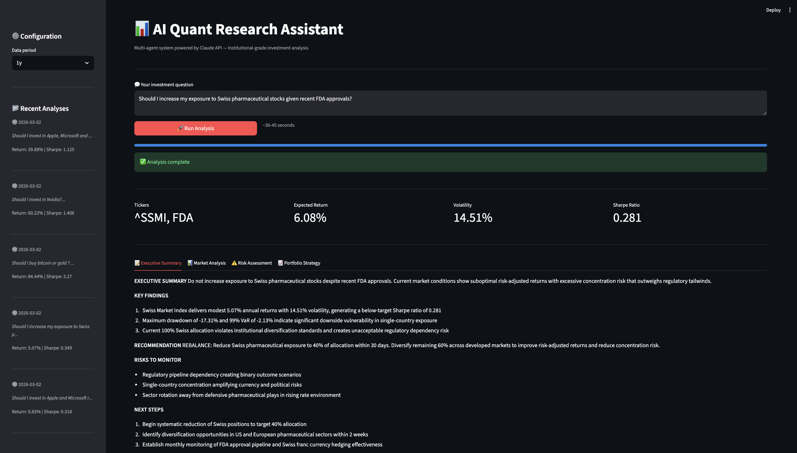
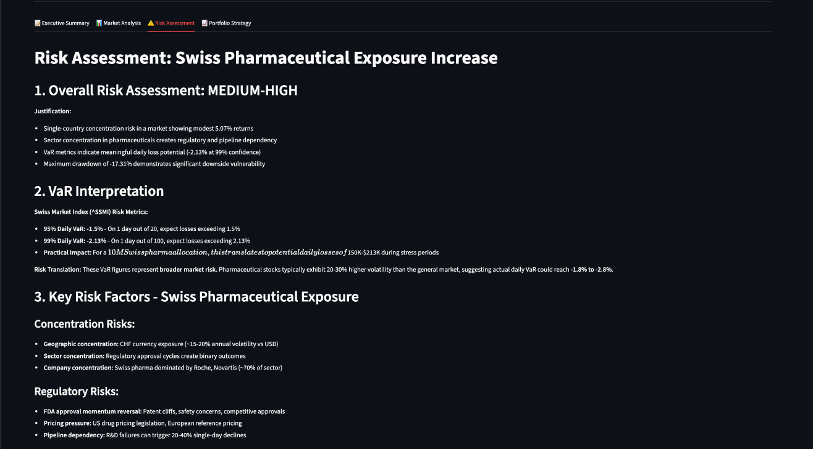
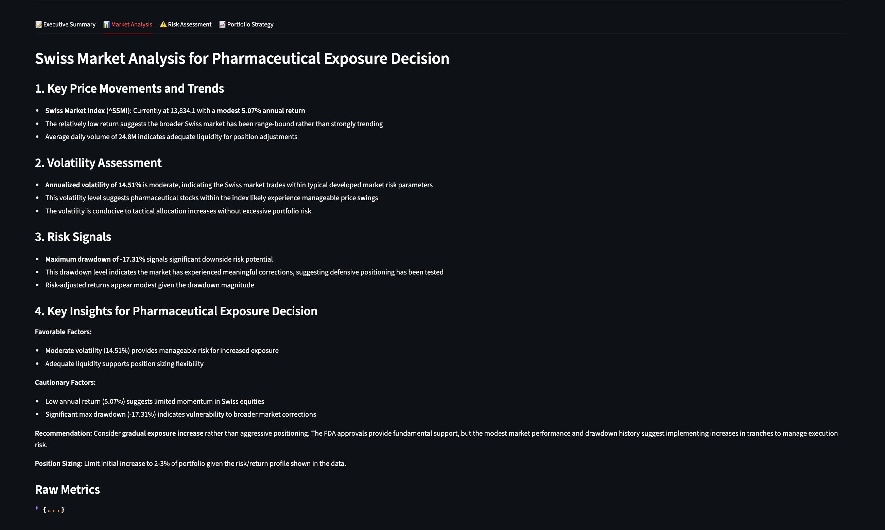

#  AI Quant Research Assistant

> Multi-agent AI system that replicates an  investment research team — powered by Claude API.


---

##  Overview

Ask any investment question in plain English. Four specialized Claude agents work in sequence to deliver institutional-style analysis in under 60 seconds.

The system replicates a real buy-side research workflow:
- **Data** is fetched live from market APIs
- **Risk** is calculated quantitatively (VaR, drawdown, stress tests)
- **Allocation** is optimized via real Markowitz (scipy.optimize, long-only constraints)
- **Output** is a CIO-level executive memo + PDF report

---

##  Design Principles

- **Deterministic quantitative core** — VaR, drawdown, and Sharpe are computed mathematically, not generated by LLMs
- **LLMs used for reasoning, not computation** — Claude interprets and communicates results, never calculates them
- **Transparent assumptions** — risk-free rate, constraints, and annualization factors are explicit and documented
- **Reproducible outputs** — same query on same data always produces same quantitative metrics
---

##  Demo

**Input:**
```
Should I increase my exposure to Swiss pharmaceutical stocks
given recent FDA approvals?
```

**Output (< 60 seconds):**
```
EXECUTIVE SUMMARY
Do not increase exposure to Swiss pharmaceutical stocks despite
recent FDA approvals. Current market conditions show suboptimal
risk-adjusted returns with excessive concentration risk that
outweighs regulatory tailwinds.

KEY FINDINGS
1. Swiss Market Index delivers 5.07% returns with 14.51% volatility
   → Sharpe ratio of 0.281 (below institutional threshold of 0.35)
2. Max drawdown of -17.31% and 99% VaR of -2.13% indicate significant
   downside vulnerability in single-country exposure
3. 100% Swiss allocation violates institutional diversification standards
   and creates unacceptable regulatory dependency risk

RECOMMENDATION
REBALANCE: Reduce Swiss pharma exposure to 40% within 30 days.
Diversify remaining 60% across developed markets.

RISKS TO MONITOR
- Regulatory pipeline dependency creating binary outcome scenarios
- CHF/USD currency risk (~15-20% annual volatility impact)
- Sector rotation away from defensive pharma in rising rate environment

NEXT STEPS
1. Begin systematic reduction of Swiss positions to 40% target allocation
2. Identify diversification in US and European pharma within 2 weeks
3. Establish monthly FDA pipeline monitoring + CHF hedge review
```
> Each analysis automatically generates an institutional PDF report 
> saved to `reports/generated/`
---

## Screenshots

**Full Interface — Executive Summary**


**Risk Assessment — VaR & Stress Tests**


**Market Analysis — Live Data**


---

## 🏗️ Architecture
```
User Query (natural language)
         │
         ▼
┌────────────────────────────────────────┐
│        MultiAgentOrchestrator          │
│                                        │
│  ┌─────────────┐                       │
│  │   Agent 1   │ Market Data Analyst   │
│  │  yfinance   │ → prices, returns,    │
│  │  + Claude   │   volatility, trends  │
│  └──────┬──────┘                       │
│         │                              │
│  ┌──────▼──────┐                       │
│  │   Agent 2   │ Risk Assessor         │
│  │  numpy VaR  │ → VaR 95/99%,        │
│  │  + Claude   │   drawdown, stress    │
│  └──────┬──────┘                       │
│         │                              │
│  ┌──────▼──────┐                       │
│  │   Agent 3   │ Portfolio Strategist  │
│  │   scipy     │ → Markowitz weights,  │
│  │  Markowitz  │   Sharpe, allocation  │
│  └──────┬──────┘                       │
│         │                              │
│  ┌──────▼──────┐                       │
│  │   Agent 4   │ Executive Synthesizer │
│  │   Claude    │ → CIO memo,           │
│  │             │   next steps, PDF     │
│  └──────┬──────┘                       │
└─────────┼──────────────────────────────┘
          │
    ┌─────┴──────┐
    │            │
    ▼            ▼
SQLite DB    PDF Report
(history)   (ReportLab)
```


---

##  Agent Specifications

| Agent | Role | Input | Key Output |
|-------|------|-------|-----------|
| **Market Analyst** | Fetch & analyze live market data | User query + tickers | Returns, volatility, trends, anomalies |
| **Risk Assessor** | Quantitative risk management | Agent 1 output | VaR 95/99%, max drawdown, stress scenarios |
| **Portfolio Strategist** | Markowitz optimization | Agent 1+2 outputs | Optimal weights, Sharpe ratio, entry strategy |
| **Executive Synthesizer** | CIO-level communication | All agents outputs | Executive memo, key findings, next steps |

Each agent receives the full output of all previous agents — context accumulates through the chain.

---

##  Methodology

### Value at Risk (VaR) — Parametric Method

$$VaR(\alpha) = -(\mu + z(\alpha) \times \sigma_{daily})$$

Note: $\mu \approx 0$ on short horizons, but included for mathematical rigor.

Where:

$$z_{0.95} = 1.645 \quad z_{0.99} = 2.326 \quad \sigma_{daily} = \frac{\sigma_{annual}}{\sqrt{252}}$$

Computed in `risk_assessor.py` via numpy. Represents the maximum expected daily loss at a given confidence level.

---

### Maximum Drawdown

$$MDD = \min_{t} \left( \frac{P_t - P_{peak,t}}{P_{peak,t}} \right)$$

Where $P_{peak,t} = \max_{\tau \leq t} P_\tau$ is the expanding maximum of the price series up to time $t$.

---

### Sharpe Ratio

$$Sharpe = \frac{R_p - R_f}{\sigma_p}$$

Where:
- $R_p$ = annualized portfolio return
- $R_f$ = 2% risk-free rate — Swiss context (configurable in `base_agent.py`)
- $\sigma_p$ = annualized portfolio volatility

---

### Markowitz Optimization — scipy.optimize

**Objective:** Maximize Sharpe ratio

$$\max_{w} \frac{w^\top \mu - R_f}{\sqrt{w^\top \Sigma w}}$$

**Subject to:**

$$\sum_{i=1}^{n} w_i = 1 \quad \text{(fully invested)}$$

$$0.05 \leq w_i \leq 0.60 \quad \forall i \quad \text{(long-only, max 60\% per asset)}$$

**Covariance matrix** $\Sigma$ computed on 252 trading days of real daily returns, annualized:

$$\Sigma_{annual} = \Sigma_{daily} \times 252$$

Solved via `scipy.optimize.minimize` with SLSQP method.

---

## Limitations

Being transparent about what this system does and does not do:

| Limitation | Detail |
|-----------|--------|
| **Parametric VaR** | Assumes normal distribution of returns. Understates tail risk in fat-tailed markets. Historical simulation would be more robust. |
| **No transaction costs** | Optimization ignores bid-ask spreads, commissions, and market impact. Real execution costs would reduce expected returns. |
| **yfinance data quality** | Free API with potential latency and survivorship bias. Not suitable for production trading without a premium data source. |
| **LLM hallucination risk** | Claude agents interpret quantitative metrics — qualitative commentary may not always align perfectly with the numbers. Always verify recommendations. |
| **Single-period optimization** | Markowitz is solved on a static 1-year window. No rolling reoptimization or regime detection. |
| **Limited universe** | Ticker extraction covers major US and Swiss equities. Emerging markets, fixed income, and alternatives are not supported. |

---

##  Quick Start

### Prerequisites
- Python 3.10+
- Anthropic API key → [console.anthropic.com](https://console.anthropic.com)

### Installation

```bash
# 1. Clone
git clone https://github.com/EMen11/AI-quant-research-assistant.git
cd AI-quant-research-assistant

# 2. Virtual environment
python3 -m venv venv
source venv/bin/activate

# 3. Dependencies
pip install -r requirements.txt

# 4. API key
cp .env.example .env
# Edit .env → add your ANTHROPIC_API_KEY

# 5. Launch
streamlit run app/streamlit_app.py
```

### CLI mode

```bash
python3 main.py
```

---

## 🛠️ Tech Stack

| Layer | Technology | Purpose |
|-------|-----------|---------|
| AI Engine | Anthropic Claude Sonnet | 4 specialized agents |
| Optimization | scipy.optimize (SLSQP) | Markowitz portfolio optimization |
| Market Data | yfinance | Live prices, returns, volume |
| Data Processing | pandas, numpy | Metrics calculation, covariance matrix |
| Interface | Streamlit | Web application |
| PDF Reports | ReportLab | Institutional report generation |
| Storage | SQLite + SQLAlchemy | Conversation history |
| Config | python-dotenv, PyYAML | Environment management |

---

## 📁 Project Structure

```
ai-quant-research-assistant/
├── src/
│   ├── agents/
│   │   ├── base_agent.py              # Claude API client + base class
│   │   ├── market_analyst.py          # Agent 1: live data + trends
│   │   ├── risk_assessor.py           # Agent 2: VaR, drawdown, stress tests
│   │   ├── portfolio_strategist.py    # Agent 3: scipy Markowitz optimization
│   │   └── executive_synthesizer.py  # Agent 4: CIO memo generation
│   ├── orchestrator.py                # Chain orchestration + SQLite persistence
│   ├── data_fetcher.py                # yfinance wrapper + metric calculations
│   └── report_generator.py           # PDF generation (ReportLab)
├── app/
│   └── streamlit_app.py              # Streamlit web interface
├── assets/                           # Screenshots for documentation
├── data/                             # SQLite conversation history
├── reports/generated/                # PDF outputs
├── requirements.txt
├── .env.example
└── main.py                           # CLI entry point
```

---

> *Built to demonstrate multi-agent AI orchestration applied to institutional quantitative finance.*
> *For informational and educational purposes only — not financial advice.*
```
