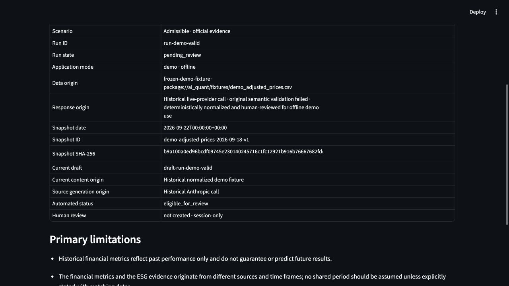
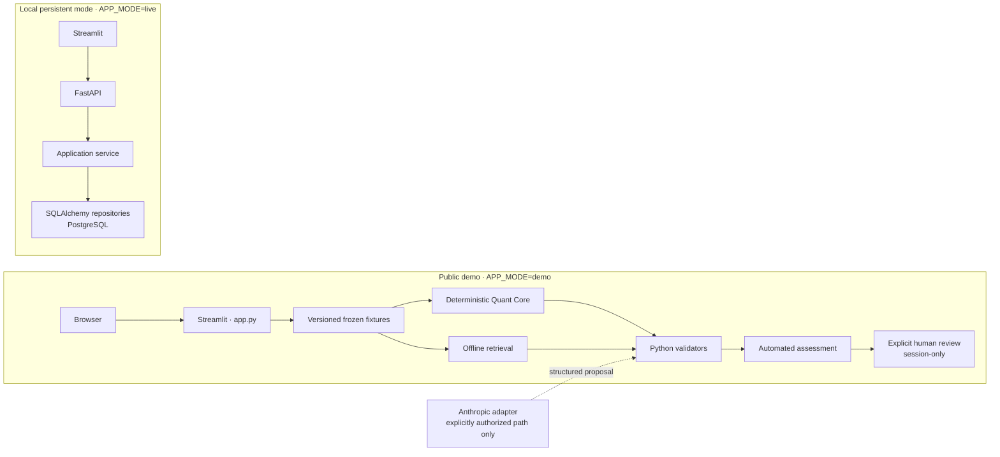

# AI Quant Research Workbench

[](https://github.com/EMen11/AI-quant-research-assistant/actions/workflows/ci.yml?query=branch%3Amain)


AI Quant Research Workbench is a reference implementation for producing traceable financial and
climate-research drafts without allowing generated text to become trusted evidence or an automatic
decision. Deterministic Python owns quantitative calculations, evidence identities, validation and
workflow state; structured generation can only propose bounded text and references. The project is
designed to make assumptions, provenance, failure states and the remaining need for human review
visible rather than hide them behind a chat interface.

**Public demo:**
[open the Streamlit application](https://ai-quant-research-assistant-2wpsobhnavfaznnp4pjmxt.streamlit.app/)

The public application is a frozen, read-only demonstration. It does **not** generate a new LLM
answer, download market data, connect to PostgreSQL or call Anthropic when a visitor opens it.



## A short demonstration path

1. Open **Overview** and confirm the banner says `APP_MODE=demo` and the admissible scenario is
   `eligible_for_review`, not approved.
2. Open **Quant** to inspect the immutable market snapshot, assumptions, deterministic metrics and
   optimizer diagnostics.
3. Open **Climate Evidence** to inspect issuer, document date, page, excerpt, source hash and
   assurance/comparability metadata.
4. Open **Validation & Review** and confirm that no `HumanReview` exists at session start.
5. Select the blocked scenario. It must show `review_required`, failed validation, an untrusted
   result, critical findings and no approved export.
6. Use **Quality** and **Methodology** to inspect the versioned evaluation results and the limits
   attached to them.

The automatic statuses only route work. `eligible_for_review` means that the implemented checks
found no blocking issue; it is not an analytical approval. A `HumanReview` is a separate explicit
decision, and reviews created in the public demo are unauthenticated, session-only and discarded
with the session.

## Architecture and trust boundaries


```mermaid
flowchart LR
    subgraph Public["Public demo · APP_MODE=demo"]
        U["Browser"] --> S["Streamlit · app.py"]
        S --> F["Versioned frozen fixtures"]
        F --> Q["Deterministic Quant Core"]
        F --> R["Offline retrieval"]
        Q --> V["Python validators"]
        R --> V
        V --> A["Automated assessment"]
        A --> H["Explicit human review\nsession-only"]
    end

    subgraph Local["Local persistent mode · APP_MODE=live"]
        LS["Streamlit"] --> API["FastAPI"]
        API --> SV["Application service"]
        SV --> DB["SQLAlchemy repositories\nPostgreSQL"]
    end

    LLM["Anthropic adapter\nexplicitly authorized path only"] -. "structured proposal" .-> V
```

The public path imports neither the live provider adapter nor the FastAPI/PostgreSQL stack. The
local `APP_MODE=live` name identifies the API and persistence transport; its implemented analysis
input is still labelled `frozen_offline_fixture` and does not imply live market data or a live model
call. The Anthropic adapter exists behind a separate, explicit configuration and authorization
boundary and is not part of the deployed demo.

Generated content is always untrusted input. Python creates run, metric, evidence and claim
identifiers; injects deterministic numeric values; checks every reference against the active run;
and creates the `ValidationReport` and `AutomatedAssessment`. Only a person can create a
`HumanReview` disposition.

## Delivery status

| Area | Status | What is available | Boundary or evidence |
|---|---|---|---|
| Deterministic quant core | **Implemented** | Frozen snapshot lineage; return, volatility, drawdown, VaR/ES, covariance/correlation and constrained Markowitz scenario | Synthetic daily price history; no forecast, backtest, fees or FX conversion. See [quant methodology](docs/methodology/quant_methodology.md). |
| Climate evidence | **Implemented** | Versioned records for two issuers, with dates, pages, excerpts, units, source hashes, assurance and explicit comparability decisions | Small manually reviewed corpus, not comprehensive ESG coverage. See [corpus methodology](docs/methodology/sustainability_corpus.md). |
| Retrieval | **Implemented** | Deterministic filters plus BM25 and long-context baselines over versioned passages | Small ten-question gold set; no embeddings, reranker or vector store. See [retrieval methodology](docs/methodology/retrieval_and_llm.md). |
| Structured generation boundary | **Implemented** | Closed schemas, exact reference allowlists, one-call budget, mocked transport tests and sanitized metadata | The public fixture derives from a historical provider response; no live generation occurs in the demo. |
| Validation and review routing | **Implemented** | Run-scoped references, numeric substitution, blocking findings, three automatic routing statuses and a separate human-decision record | Covered rules and attack families only; `eligible_for_review` never means approved. See [trust boundaries](docs/methodology/trust_boundaries.md). |
| Public Streamlit experience | **Demo-only** | Six views, admissible and blocked scenarios, evidence inspection and session review workflow | Frozen artifacts; reviews are unauthenticated and non-persistent; no provider, database or market-network call. |
| Local API and persistence | **Implemented** | FastAPI, SQLAlchemy repositories, Alembic, PostgreSQL and Docker Compose; atomic/idempotent analysis writes and append-only application APIs | Local workflow uses the frozen fixture. The append-only guarantee is application-level, not WORM or administrator-proof. See [local stack](docs/block8_local_stack.md). |
| Public durable review workflow | **Planned** | — | Authentication, durable reviewer identity and public PostgreSQL persistence are not deployed. |
| Candidate release sign-off | **Implemented** | Clean-clone installation, green CI, verified public URL, two complete demonstrations and final independent review | Final verdict: `GO WITH LIMITATIONS`, with P0=0 and P1=0. Remaining limitations are documented below; no tag or GitHub release exists yet. |

## Measured results and their scope

These numbers describe specific versioned evaluation sets or software checks. They are not added
together, and passing tests is not presented as a measure of analytical quality.

| Result | Exact scope | Version / reference |
|---|---|---|
| BM25 recall@1 **0.90**, recall@3 **1.00**; long-context recall@1 **0.70**, recall@3 **0.90** | Ten frozen retrieval questions: six filter-only and four ranking cases. On the four ranking cases, BM25 is 0.75/1.00 and long-context is 0.25/0.75. | [`retrieval_baselines.v1.json`](reports/evaluation/retrieval_baselines.v1.json), current report SHA-256 `4edf1936d7932ab1270879dcfd7c376d957402ab508377bae43fafd24586ad6b` |
| **24/24** expected routing outcomes; **0/18** critical cases incorrectly marked eligible | Eight development, eight validation and eight frozen holdout cases in the exact covered rule and attack families. Thirteen error categories have one positive case each; the holdout is neither external nor historically blind. | [`workflow_eval.v1.json`](reports/evaluation/workflow_eval.v1.json), dataset SHA-256 `db7cab17163e5df41d4e15ceb7c8e3524ccb1f6d2529c1a9c23967a967d6516e`, report last changed at `4eee6d637ac7d0bf0df2ee77d923f5a0337619cc` |
| PostgreSQL/API/Docker verification completed, including an empty-database migration, repository/API tests, atomicity, rollback, idempotency, constraints, versioning and a Streamlit → FastAPI → PostgreSQL smoke test | Local disposable Docker environment. The full suite recorded for this gate was 367 passed, one expected live-path skip and two third-party warnings; this suite overlaps targeted checks and is not combined with them. | Block 8 commit `23c4f9192aedf9899989a839ae53f3b80b99f6a2`; details in [`SPEEDRUN_STATUS.md`](SPEEDRUN_STATUS.md) |
| Final offline release-candidate suite: **354 passed, 20 skipped**, with two third-party warnings | `APP_MODE=demo`, locked dependencies and uv offline execution. Nineteen skips require the disposable PostgreSQL environment and one requires the separate live FastAPI/Streamlit smoke path exercised in Block 8. | Commit `0adf6c70e22153ada790a578d65fb3b4c5958306`; [green stable-branch CI](https://github.com/EMen11/AI-quant-research-assistant/actions/runs/36254458006) |
| Two distinct complete public demonstrations passed | Six views, admissible and blocked scenarios, evidence, validation, no initial `HumanReview`, no persisted review and no observed application error. | [Public demo](https://ai-quant-research-assistant-2wpsobhnavfaznnp4pjmxt.streamlit.app/); final verification recorded in [`SPEEDRUN_STATUS.md`](SPEEDRUN_STATUS.md) |

Timing data in `workflow_eval.v1.timing.json` measures only the deterministic validation evaluation
pipeline on one recorded machine. It is not a portable benchmark and does not measure retrieval,
generation, rendering, a provider call or the full application.

## Run the frozen demo

Prerequisites are Python 3.12 and [uv](https://docs.astral.sh/uv/). Dependency installation may
need registry access when the locked packages are not cached:

```bash
git clone https://github.com/EMen11/AI-quant-research-assistant.git
cd AI-quant-research-assistant
uv sync --frozen --all-groups
APP_MODE=demo uv run --frozen streamlit run app.py
```

After installation, the documented release checks can execute with uv network access disabled:

```bash
uv lock --check
uv run --frozen ruff check .
uv run --offline --frozen python scripts/scan_tracked_secrets.py
APP_MODE=demo UV_OFFLINE=1 uv run --offline --frozen pytest -q \
  tests/integration/test_block9_demo_release.py
APP_MODE=demo UV_OFFLINE=1 uv run --offline --frozen pytest -q
```

The socket guard used by the release test rejects non-loopback Python socket connections while
allowing localhost health checks. It is a process-level test boundary, not an operating-system
firewall and not a guarantee about browsers, native code or deliberately altered subprocesses.
See the complete [deployment and smoke-test procedure](docs/deployment.md).

## Run the local persistent stack

Docker Compose starts PostgreSQL, applies Alembic migrations, then starts FastAPI and Streamlit.
The values below are explicit local placeholders, not production credentials:

```bash
BLOCK8_POSTGRES_DB=ai_quant_local \
BLOCK8_POSTGRES_USER=ai_quant_local \
BLOCK8_POSTGRES_PASSWORD=block8-local-placeholder \
docker compose up --build -d

docker compose ps
docker compose logs --no-color --tail=100
docker compose down
```

Streamlit is exposed at `http://127.0.0.1:8501` and FastAPI at
`http://127.0.0.1:8000`. The migration head is `20260924_0002`. The earlier local,
uncommitted `20260924_0001` stamp is not part of the final migration graph; a database carrying
that stamp must be recreated or handled through an explicit manual migration and fails closed by
default. Full operational and disposable-database instructions are in
[`docs/block8_local_stack.md`](docs/block8_local_stack.md).

## Known limitations

- Demo market prices are synthetic and climate content is historical; neither is a current market
  view, a forecast, an impact measurement or investment advice.
- Quantitative estimates use a short frozen sample. Markowitz inputs are in-sample historical
  estimates and no predictive backtest is claimed.
- The climate corpus covers two issuers and selected reported indicators. Different scopes,
  methods, periods, organizational boundaries and assurance levels limit comparison.
- Retrieval and validation results apply only to the named, versioned datasets and covered attack
  families. They do not establish real-world generalization or universal prompt-injection safety.
- The public demo does not authenticate reviewers or persist reviews. PostgreSQL persistence is a
  separate local workflow.
- The tracked-file secret scan is focused and masks findings; it is not a scan of all Git history,
  host configuration or platform-managed secrets.
- Release-candidate gates were reproduced from a clean clone, the public URL was verified twice
  through complete demonstrations, and the final independent review concluded `GO WITH
  LIMITATIONS` with P0=0 and P1=0. Mobile verification used a 390×844 emulated viewport; no test
  on a physical phone is claimed.

## Release-candidate validation

The application-ready candidate has completed its documented gates:

- clean-clone installation, lockfile verification, Ruff and the masked tracked-file secret scan;
- the final offline suite with 354 passed tests, 20 explained skips and two third-party warnings;
- local offline Streamlit verification and two distinct complete public demonstrations;
- green candidate and stable-branch CI, including [run 36254458006](https://github.com/EMen11/AI-quant-research-assistant/actions/runs/36254458006);
- final independent review: `GO WITH LIMITATIONS`, P0=0 and P1=0.

The remaining publication operations are deliberate and manual: fast-forward `main` after this
documentation closure is accepted, then decide whether to create the proposed `v1.0.0-demo` tag
and GitHub release. Neither the tag nor the release exists yet.

This repository is licensed under the [MIT License](LICENSE). All outputs are for research and
educational use only and require independent human verification.
