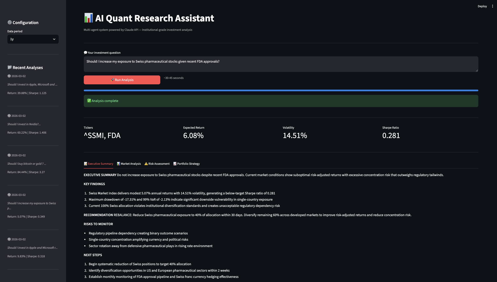
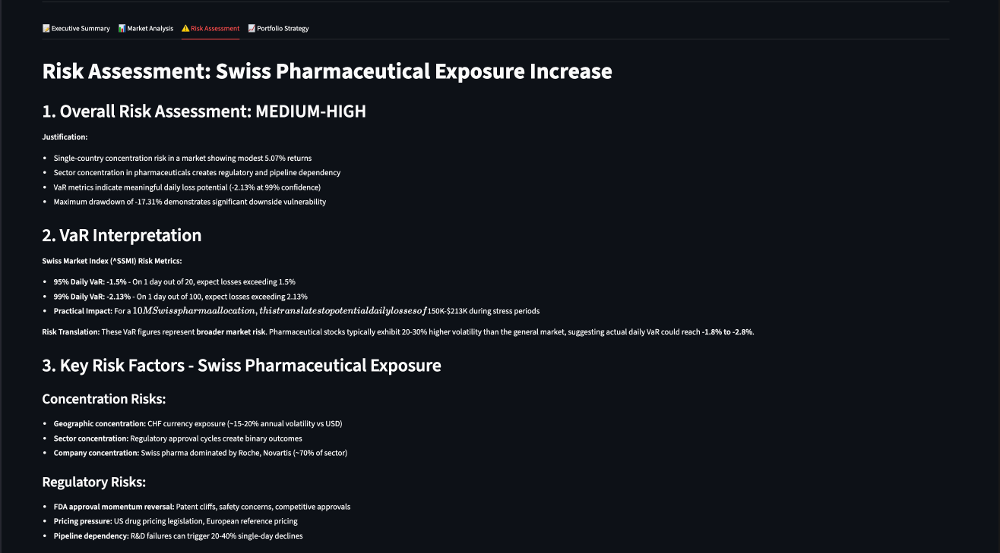
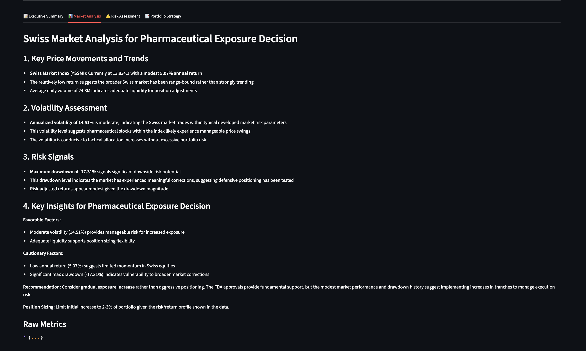

# AI Quant Research Assistant — Controlled AI Financial Research Workflow

> A Python workflow combining deterministic risk analytics with LLM-based interpretation for structured financial research memos.


---

## Reproducible Block 1 foundation

The default application is now a small, frozen public demo. With `APP_MODE=demo` (the
default), startup uses `FakeLLM` and `FrozenMarketDataProvider`: it requires no API key,
market download, database, or paid network call. The historical prototype modules remain in
the repository for later migration, but the public entry point does not import or execute them.

### Install, run, test, and verify

Prerequisites: Python 3.12 and [uv](https://docs.astral.sh/uv/).

```bash
# Reproduce the complete development environment from uv.lock
uv sync --frozen --all-groups

# Start the offline Streamlit demo
APP_MODE=demo uv run streamlit run app.py

# Run tests
uv run pytest -q

# Run the same local quality gates as CI
uv run ruff check .
uv run pytest -q
```

The package is installed by `uv sync` and can be imported without changing `sys.path`:

```bash
uv run python -c "import ai_quant; print(ai_quant.__version__)"
```

On affected macOS filesystems, Python 3.12 can ignore editable `.pth` files below `.venv`
when Finder reapplies the `UF_HIDDEN` flag. Use a visible environment behind the conventional
`.venv` path instead; `uv run` and editors continue to discover it normally:

```bash
uv venv --python 3.12 venv
ln -s venv .venv
uv sync --frozen --all-groups
```

Both paths are ignored by Git. This avoids `PYTHONPATH`, source-path injection, and a temporary
`chflags` workaround.

For Streamlit Community Cloud, use `app.py` as the entry point, select Python 3.12, and
leave the Secrets field empty for demo mode. Community Cloud reads the committed `uv.lock`.
The historical live prototype remains available at `app/streamlit_app.py`; it is not the
Community Cloud demo entry point and may perform live market and Anthropic calls.

Copy `.env.example` to `.env` only for local configuration. A real Anthropic key is required
only when explicitly selecting `APP_MODE=live`; live wiring is outside Block 1.

---

## Historical prototype overview

The following sections describe the preserved pre-migration workflow. They are not executed by
the default Block 1 demo and will be migrated behind the new interfaces in later blocks.

Ask any investment question in plain English. Four specialized Claude agents work in sequence to deliver institutional-style analysis in under 60 seconds.

The system replicates a real buy-side research workflow:
- **Data** is fetched live from market APIs
- **Risk** is calculated quantitatively (VaR, drawdown, stress tests)
- **Allocation** is optimized via real Markowitz (scipy.optimize, long-only constraints)
- **Output** is a CIO-level executive memo + PDF report

---

##  Design Principles

- **Deterministic quantitative core** — VaR, drawdown, and Sharpe are computed mathematically, not generated by LLMs
- **LLMs used for reasoning, not computation** — Claude interprets and communicates results, never calculates them
- **Transparent assumptions** — risk-free rate, constraints, and annualization factors are explicit and documented
- **Reproducible outputs** — same query on same data always produces same quantitative metrics

---

## Why this is not just a chatbot

This project separates quantitative computation from LLM-based interpretation. Market data, returns, VaR, drawdown, Sharpe ratio and portfolio weights are computed deterministically using Python, NumPy, pandas and scipy. The LLM is used only to interpret results, structure the analysis and generate an executive-style research memo. It cannot modify or override the underlying metrics.

---

## Controls & Guardrails

The following controls are actually implemented in the codebase:

- **Ticker validation** — keyword-based extraction with an explicit blacklist (generic terms such as USA, US, NATO, GDP are rejected). When no relevant financial instrument is identified, the pipeline returns early with a message asking the user to specify assets rather than defaulting to an arbitrary index.
- **Missing data guards** — `fetch_market_data` skips tickers that return empty histories from yfinance. `calculate_metrics` skips any series with fewer than two data points. `portfolio_strategist` guards against empty returns DataFrames before attempting Markowitz optimisation.
- **Error handling** — `try/except` blocks around all yfinance calls; the Streamlit interface catches and displays exceptions without crashing.
- **API key handling** — the Anthropic API key is loaded exclusively from a `.env` file via `python-dotenv`. It is not hardcoded anywhere in the source.
- **Output persistence** — every completed analysis is saved to SQLite with a timestamp, the original query, tickers, and key metrics.
- **Deterministic metric separation** — VaR (parametric, numpy), max drawdown, Sharpe ratio, and Markowitz portfolio weights are all computed in Python before the LLM receives any data. The LLM only receives pre-computed numbers; it does not perform calculations.
- **UI disclaimer** — a visible research-purposes-only disclaimer is displayed in the Streamlit interface above the input area.
- **Data source transparency** — the Streamlit interface displays the market data source (Yahoo Finance via yfinance) above the input area.

### Future controls to add

The following controls are **not yet implemented** and are listed here for transparency:

- Retrieval timestamp displayed alongside market data in the UI
- Automated metric consistency check (verifying that LLM prose does not contradict computed numbers)
- Input rate limiting and API quota management

---

##  Demo

**Input:**
```
Should I increase my exposure to Swiss pharmaceutical stocks
given recent FDA approvals?
```

**Output (< 60 seconds):**
```
EXECUTIVE SUMMARY
Do not increase exposure to Swiss pharmaceutical stocks despite
recent FDA approvals. Current market conditions show suboptimal
risk-adjusted returns with excessive concentration risk that
outweighs regulatory tailwinds.

KEY FINDINGS
1. Swiss Market Index delivers 5.07% returns with 14.51% volatility
   → Sharpe ratio of 0.281 (below institutional threshold of 0.35)
2. Max drawdown of -17.31% and 99% VaR of -2.13% indicate significant
   downside vulnerability in single-country exposure
3. 100% Swiss allocation violates institutional diversification standards
   and creates unacceptable regulatory dependency risk

RESEARCH VIEW
REBALANCE: Reduce Swiss pharma exposure to 40% within 30 days.
Diversify remaining 60% across developed markets.

RISKS TO MONITOR
- Regulatory pipeline dependency creating binary outcome scenarios
- CHF/USD currency risk (~15-20% annual volatility impact)
- Sector rotation away from defensive pharma in rising rate environment

NEXT STEPS
1. Begin systematic reduction of Swiss positions to 40% target allocation
2. Identify diversification in US and European pharma within 2 weeks
3. Establish monthly FDA pipeline monitoring + CHF hedge review
```
> Each analysis automatically generates an institutional PDF report 
> saved to `reports/generated/`
---

## Screenshots

**Full Interface — Executive Summary**


**Risk Assessment — VaR & Stress Tests**


**Market Analysis — Live Data**


---

## 🏗️ Architecture
```
User Query (natural language)
         │
         ▼
┌────────────────────────────────────────┐
│        MultiAgentOrchestrator          │
│                                        │
│  ┌─────────────┐                       │
│  │   Agent 1   │ Market Data Analyst   │
│  │  yfinance   │ → prices, returns,    │
│  │  + Claude   │   volatility, trends  │
│  └──────┬──────┘                       │
│         │                              │
│  ┌──────▼──────┐                       │
│  │   Agent 2   │ Risk Assessor         │
│  │  numpy VaR  │ → VaR 95/99%,        │
│  │  + Claude   │   drawdown, stress    │
│  └──────┬──────┘                       │
│         │                              │
│  ┌──────▼──────┐                       │
│  │   Agent 3   │ Portfolio Strategist  │
│  │   scipy     │ → Markowitz weights,  │
│  │  Markowitz  │   Sharpe, allocation  │
│  └──────┬──────┘                       │
│         │                              │
│  ┌──────▼──────┐                       │
│  │   Agent 4   │ Executive Synthesizer │
│  │   Claude    │ → CIO memo,           │
│  │             │   next steps, PDF     │
│  └──────┬──────┘                       │
└─────────┼──────────────────────────────┘
          │
    ┌─────┴──────┐
    │            │
    ▼            ▼
SQLite DB    PDF Report
(history)   (ReportLab)
```


---

##  Agent Specifications

| Agent | Role | Input | Key Output |
|-------|------|-------|-----------|
| **Market Analyst** | Fetch & analyze live market data | User query + tickers | Returns, volatility, trends, anomalies |
| **Risk Assessor** | Quantitative risk management | Agent 1 output | VaR 95/99%, max drawdown, stress scenarios |
| **Portfolio Strategist** | Markowitz optimization | Agent 1+2 outputs | Optimal weights, Sharpe ratio, entry strategy |
| **Executive Synthesizer** | CIO-level communication | All agents outputs | Executive memo, key findings, next steps |

Each agent receives the full output of all previous agents — context accumulates through the chain.

---

##  Methodology

### Value at Risk (VaR) — Parametric Method

$$VaR(\alpha) = -(\mu + z(\alpha) \times \sigma_{daily})$$

Note: $\mu \approx 0$ on short horizons, but included for mathematical rigor.

Where:

$$z_{0.95} = 1.645 \quad z_{0.99} = 2.326 \quad \sigma_{daily} = \frac{\sigma_{annual}}{\sqrt{252}}$$

Computed in `risk_assessor.py` via numpy. Represents the maximum expected daily loss at a given confidence level.

---

### Maximum Drawdown

$$MDD = \min_{t} \left( \frac{P_t - P_{peak,t}}{P_{peak,t}} \right)$$

Where $P_{peak,t} = \max_{\tau \leq t} P_\tau$ is the expanding maximum of the price series up to time $t$.

---

### Sharpe Ratio

$$Sharpe = \frac{R_p - R_f}{\sigma_p}$$

Where:
- $R_p$ = annualized portfolio return
- $R_f$ = 2% risk-free rate — Swiss context (configurable in `base_agent.py`)
- $\sigma_p$ = annualized portfolio volatility

---

### Markowitz Optimization — scipy.optimize

**Objective:** Maximize Sharpe ratio

$$\max_{w} \frac{w^\top \mu - R_f}{\sqrt{w^\top \Sigma w}}$$

**Subject to:**

$$\sum_{i=1}^{n} w_i = 1 \quad \text{(fully invested)}$$

$$0.05 \leq w_i \leq 0.60 \quad \forall i \quad \text{(long-only, max 60\% per asset)}$$

**Covariance matrix** $\Sigma$ computed on 252 trading days of real daily returns, annualized:

$$\Sigma_{annual} = \Sigma_{daily} \times 252$$

Solved via `scipy.optimize.minimize` with SLSQP method.

---

## Limitations

Being transparent about what this system does and does not do:

| Limitation | Detail |
|-----------|--------|
| **Parametric VaR** | Assumes normal distribution of returns. Understates tail risk in fat-tailed markets. Historical simulation would be more robust. |
| **No transaction costs** | Optimization ignores bid-ask spreads, commissions, and market impact. Real execution costs would reduce expected returns. |
| **yfinance data quality** | Free API with potential latency and survivorship bias. Not suitable for production trading without a premium data source. |
| **LLM hallucination risk** | Claude agents interpret quantitative metrics — qualitative commentary may not always align perfectly with the numbers. Always verify analytical outputs against the raw metrics. |
| **Single-period optimization** | Markowitz is solved on a static 1-year window. No rolling reoptimization or regime detection. |
| **Limited universe** | Ticker extraction covers major US and Swiss equities. Emerging markets, fixed income, and alternatives are not supported. |

---

##  Quick Start

### Prerequisites
- Python 3.12
- `uv`

### Installation

```bash
# 1. Clone
git clone https://github.com/EMen11/AI-quant-research-assistant.git
cd AI-quant-research-assistant

# 2. Locked dependencies and importable package
uv sync --frozen --all-groups

# 3. Launch the offline demo (APP_MODE=demo is also the default)
APP_MODE=demo uv run streamlit run app.py
```

## 🛠️ Tech Stack

| Layer | Technology | Purpose |
|-------|-----------|---------|
| AI Engine | Anthropic Claude Sonnet | 4 specialized agents |
| Optimization | scipy.optimize (SLSQP) | Markowitz portfolio optimization |
| Market Data | yfinance | Live prices, returns, volume |
| Data Processing | pandas, numpy | Metrics calculation, covariance matrix |
| Interface | Streamlit | Web application |
| PDF Reports | ReportLab | Institutional report generation |
| Storage | SQLite standard library (historical prototype) | Conversation history |
| Config | typed environment settings; python-dotenv in legacy code | Environment management |

---

## 📁 Project Structure

```
ai-quant-research-assistant/
├── src/
│   ├── ai_quant/                       # installable Block 1 package
│   │   ├── config.py                   # typed startup configuration
│   │   ├── llm/                        # LLMClient + FakeLLM
│   │   └── market_data/                # provider interface + frozen provider
│   ├── agents/
│   │   ├── base_agent.py              # Claude API client + base class
│   │   ├── market_analyst.py          # Agent 1: live data + trends
│   │   ├── risk_assessor.py           # Agent 2: VaR, drawdown, stress tests
│   │   ├── portfolio_strategist.py    # Agent 3: scipy Markowitz optimization
│   │   └── executive_synthesizer.py  # Agent 4: CIO memo generation
│   ├── orchestrator.py                # Chain orchestration + SQLite persistence
│   ├── data_fetcher.py                # yfinance wrapper + metric calculations
│   └── report_generator.py           # PDF generation (ReportLab)
├── app/
│   └── streamlit_app.py              # preserved historical live prototype
├── assets/                           # Screenshots for documentation
├── data/                             # SQLite conversation history
├── reports/generated/                # PDF outputs
├── tests/                             # unit, integration, evaluation
├── pyproject.toml                    # dependencies and tool configuration
├── uv.lock                           # reproducible dependency resolution
├── app.py                            # offline Community Cloud entry point
├── .env.example                     # placeholders only
└── main.py                           # CLI entry point
```

---

> *Built to demonstrate multi-agent AI orchestration applied to institutional quantitative finance.*
> *For informational and educational purposes only — not financial advice.*
```
