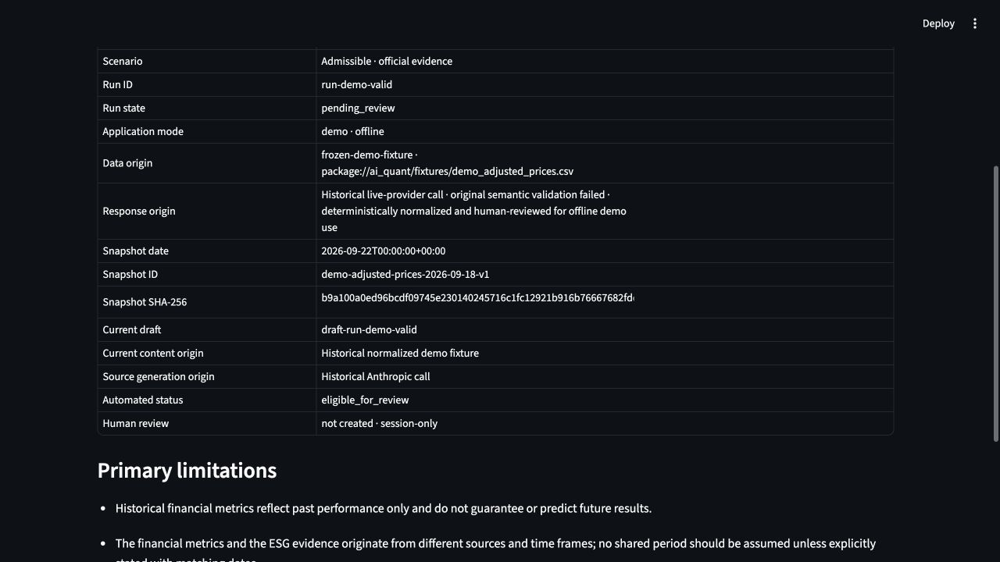
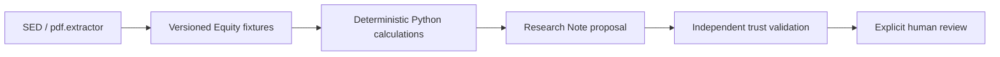
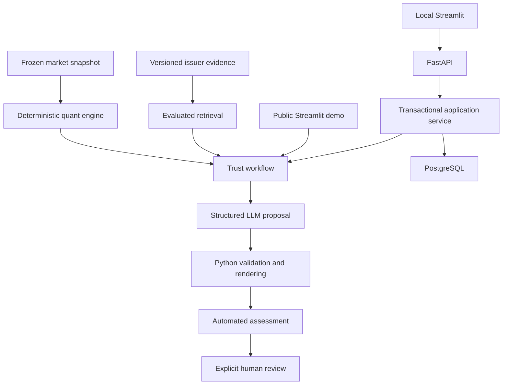

# AI Equity Research Copilot — Swiss CDMOs

[](https://github.com/EMen11/AI-quant-research-assistant/actions/workflows/ci.yml?query=branch%3Amain)


[](https://ai-quant-research-assistant-2wpsobhnavfaznnp4pjmxt.streamlit.app/)


A reproducible Equity Research case comparing **Bachem (BANB.SW)** and
**Siegfried (SFZN.SW)** across FY2021–FY2025. Deterministic Python calculations,
field-level provenance, structured AI assistance, independent trust controls, and explicit
human review remain separate by design.

**[Open the public Streamlit demo](https://ai-quant-research-assistant-2wpsobhnavfaznnp4pjmxt.streamlit.app/)**

The application keeps AI-assisted prose separate from authoritative calculations, source
records, automated validation, and human approval. It does not issue investment
recommendations, target prices, consensus estimates, or price predictions.



## Equity Research case

### Business problem

Annual reports contain the inputs needed for comparative research, but the route from a
published figure to an analyst conclusion is easy to obscure. This project asks a narrower,
testable question: what do the approved historical fundamentals, cash generation, balance
sheets, valuation and sustainability disclosures show about Bachem and Siegfried, and can
every quantitative statement remain traceable to an authorized record?

The visible result is a five-tab Equity workflow:

1. **Snapshot** — side-by-side FY2025 fundamentals;
2. **Fondamentaux** — FY2021–FY2025 growth, profitability, cash, capex and balance sheet;
3. **Valorisation** — historical fiscal-closing multiples, never presented as current prices;
4. **ESG & sources** — climate metrics, method, assurance and provenance;
5. **Research note** — comparative note, monitoring table, validation state and sources.

The comparison is descriptive and bounded. Bachem and Siegfried are both treated as Swiss
CDMOs under the approved scope; no third issuer, interim period, DCF, consensus or live market
feed is added.

### Finance, Data and AI workflow


```mermaid
flowchart LR
    SED["SED / pdf.extractor"] --> F["Versioned Equity fixtures"]
    F --> P["Deterministic Python calculations"]
    P --> N["Research Note proposal"]
    N --> V["Independent trust validation"]
    V --> H["Explicit human review"]
```

- **Finance:** compare activity, growth, margins, cash conversion, capital intensity,
  leverage, ROE, historical valuation and sustainability observations.
- **Data engineering:** load only embedded, hash-checked fixtures; preserve source document,
  fiscal year, unit, method, formula and input metric IDs.
- **AI engineering:** expose a closed allowlist of `MetricRecord` and `EvidenceRecord` objects,
  materialize a `GeneratedDraft`, then validate numbers, units, periods, citations, language
  policy and run membership before any reliable rendering.

The Equity manifest pins the upstream source to `SED/pdf.extractor` commit
`bc1c54eefd663a257aab71e58fd7953a6239a1fc`. Runtime loading does not access that repository
or the network: it verifies and consumes the committed fixtures only. Python owns every
calculation. The deterministic offline note fixture structures already-authorized content; it
does not calculate, select an investment, or approve itself.

### Research Note and human-in-the-loop

`analyst_note.v1` is a closed Pydantic contract with eleven mandatory sections. Statements are
typed as `sourced_fact`, `calculated_metric`, `analyst_interpretation`, or `limitation`.
Quantitative uses carry metric ID, value, unit and period; citations carry an Evidence ID and
exact excerpt. Unknown fields, orphan numbers, unknown citations and missing mandatory
limitations fail closed.

The admissible path is:

```text
MetricRecord → GeneratedDraft → ValidationReport → AutomatedAssessment → HumanReview
```

Automation stops at `eligible_for_review`; the Equity UI presents that as
`pending_human_review`. Only an explicit person can create a `HumanReview`. The blocked demo
scenario includes a forbidden target-price statement, produces `review_required`, and emits no
reliable note text.

The monitoring table shows the latest authorized annual KPI, descriptive direction, rationale,
source, update frequency, assurance where relevant, and freshness (`available` or `to_update`).
It contains no forecast or invented consensus. See the
[60–90 second demo script](docs/demo_equity_research.md).

### Public demo and local components

The repository's `demo` mode is fully offline and opens **Equity research** by default. The
public Streamlit deployment is built from the released branch and may lag this working branch
until it is merged and deployed. The existing **AI audit workbench** remains available locally
and in releases as the deeper technical demonstration. Its optional `live` mode connects to the
existing FastAPI/PostgreSQL stack; it is not required by the Equity workflow and does not turn
the Equity fixtures into live market data.

## Why this project exists

Generative models can produce fluent commentary while inventing a figure, citing the wrong source, or overstating historical evidence. Financial research instead needs explicit calculation conventions, document provenance, and a visible separation between automated suggestions and accountable decisions. This project makes that separation testable.

## What the application produces

| Layer | Output | Authority |
|---|---|---|
| Market snapshot | Frozen adjusted prices, dates, missing values, and lineage | Versioned input |
| Quant engine | Returns, risk metrics, matrices, and optimizer diagnostics | Deterministic Python |
| Evidence layer | Issuer, document, page, excerpt, period, and source identity | Versioned evidence |
| LLM boundary | `DraftProposal` with bounded claims and references | Untrusted proposal |
| Validation | `ValidationReport`, reliable rendering, and routing status | Deterministic Python |
| Review | Approve, correct, reject, or escalate | Explicit human decision |

## Quantitative finance

The quant engine loads one immutable `MarketSnapshot` and builds one shared return matrix from adjusted closes. Daily simple returns are aligned across instruments; missing prices are not filled, and incomplete return rows are removed before calculation.

Annualization uses 252 trading days. Volatility and covariance use sample estimates with `ddof=1`. Weights are long-only and sum to one. VaR and Expected Shortfall are positive loss magnitudes.

### Return and risk conventions

For instrument $i$, the simple daily return is:

$$r_{i,t}=\frac{P_{i,t}}{P_{i,t-1}}-1$$

The cumulative return over $T$ complete observations is:

$$R=\prod_{t=1}^{T}(1+r_t)-1$$

Historical performance is geometrically annualized:

$$R_{\mathrm{ann}}=(1+R)^{252/T}-1$$

Annualized volatility is:

$$\sigma_{\mathrm{ann}}=s(r)\sqrt{252}$$

where $s(r)$ is the sample standard deviation with `ddof=1`.

For wealth and drawdown:

$$W_t=\prod_{j\leq t}(1+r_j)$$

$$D_t=\frac{W_t}{\max_{u\leq t}(W_u)}-1$$

$$\mathrm{MDD}=-\min_t D_t$$

Parametric Gaussian VaR follows the exact implementation convention:

$$\mathrm{VaR}_c=\max\left(0,-\left(\bar r+z_{1-c}s\right)\right)$$

Here, $c$ is the confidence level, $z_{1-c}$ is the lower normal quantile, and the result is a positive one-day loss. Historical Expected Shortfall uses the empirical lower-tail average:

$$\mathrm{ES}_c=\max\left(0,-E[r\mid r\leq Q_{1-c}(r)]\right)$$

The historical Sharpe ratio is:

$$\mathrm{Sharpe}=\frac{R_{\mathrm{ann,hist}}-r_f}{\sigma_{\mathrm{ann}}}$$

### Constrained Markowitz scenario

The optimizer maximizes an in-sample historical Sharpe ratio:

$$\max_w \frac{w^\top(252\bar r)-r_f}{\sqrt{w^\top(252\Sigma)w}}$$

subject to:

$$\sum_i w_i=1,\qquad w_{\min}\leq w_i\leq w_{\max},\qquad 0\leq w_i\leq1$$

Expected returns are historical daily arithmetic means multiplied by 252. SciPy SLSQP starts from equal weights and publishes weights only after solver, bound, and sum checks succeed; failure returns diagnostics without an equal-weight fallback.

See the full [quantitative methodology](docs/methodology/quant_methodology.md).

## Worked example from the demo

The CHF snapshot contains `DEMO-ALPHA`, `DEMO-BETA`, and `DEMO-GAMMA` from 2026-08-31 through 2026-09-18: 45 price rows, one explicit missing price, and 12 complete returns after three dropped dates.

Values are reproducible from [`demo_adjusted_prices.csv`](src/ai_quant/fixtures/demo_adjusted_prices.csv) with the current engine and its labelled 1.00% synthetic CHF risk-free assumption.

The table below describes the equal-weight baseline portfolio, with 33.3333% allocated to each instrument. The optimized weights shown afterwards are a separate in-sample scenario.

> **Interpretation warning:** the sample contains only 12 complete daily returns. Annualized return and Sharpe are therefore mechanically extreme and demonstrate the calculation pipeline rather than realistic investment expectations.

| Metric | Demo value | Convention |
|---|---:|---|
| Cumulative return | 6.9821% | Full 12-observation period |
| Geometric annualized return | 312.6056% | Short historical window annualized to 252 days |
| Annualized volatility | 11.0170% | Daily sample volatility × √252 |
| Maximum drawdown | 0.8336% | Positive loss magnitude |
| 95% historical VaR | 0.3855% | Linear empirical quantile, one trading day |
| 95% parametric VaR | 0.5753% | Gaussian estimate, one trading day |
| 95% Expected Shortfall | 0.8336% | Historical tail average |
| Historical Sharpe ratio | 28.2840 | In-sample annualized history and fixture rate |

The optimization converges in seven iterations with successful solver, constraint, and bound checks. Its separate scenario weights are 74.9756% `DEMO-ALPHA`, 25.0244% `DEMO-BETA`, and effectively 0% `DEMO-GAMMA`.

## AI workflow

1. Python calculates metrics from the frozen snapshot.
2. Retrieval selects typed passages while preserving provenance.
3. Python creates run-scoped records and exact reference allowlists.
4. The LLM receives a closed `SynthesisRequest` and proposes a structured `DraftProposal`.
5. Python rechecks references, placeholders, numbers, run membership, and covered language rules.
6. Trusted values are injected only after validation; blocked drafts emit no reliable final text.
7. `AutomatedAssessment` routes the result to review.
8. A person records the disposition separately.

The LLM does not calculate metrics, create official evidence, mint trusted identifiers, or approve its output. The public demo uses a historical provider response that was normalized and reviewed for safe demo use, not analytically approved as investment research. That promotion review is distinct from a session `HumanReview` and from any investment approval.

BM25 applies metadata filters and lexical ranking. The long-context baseline supplies filtered passages in canonical order, so its ranks are positions rather than learned relevance scores.

See [retrieval and structured-generation methodology](docs/methodology/retrieval_and_llm.md).

## Responsible AI and trust boundaries

Core trust-boundary contracts use closed, immutable Pydantic models. Exact allowlists bind proposals to records from the active run. Validators cover unknown or cross-run references, placeholder mismatches, unsupported numbers, selected prompt-injection patterns, and self-approval language.

Three automatic statuses are available:

- `eligible_for_review`: no covered blocking finding was detected; human review is still required;
- `review_required`: one or more deterministic blocking findings need attention;
- `abstain`: trusted inputs are insufficient.

`ValidationReport`, `AutomatedAssessment`, and `HumanReview` are separate records. A human can approve, correct, reject, or escalate. The blocked scenario exposes critical findings and withholds reliable text and approved export.

Climate evidence preserves issuer, document, publication date, PDF and printed page, excerpt, source hash, period, coverage, and Scope 2 method. Assurance and comparability metadata remain explicit where available; disclosure is not independent verification of physical fact.

Read the [trust-boundary methodology](docs/methodology/trust_boundaries.md) and [climate-corpus methodology](docs/methodology/sustainability_corpus.md).

## Technical architecture


```mermaid
flowchart TD
    M["Frozen market snapshot"] --> Q["Deterministic quant engine"]
    D["Versioned issuer evidence"] --> R["Evaluated retrieval"]
    Q --> W["Trust workflow"]
    R --> W
    W --> L["Structured LLM proposal"]
    L --> V["Python validation and rendering"]
    V --> A["Automated assessment"]
    A --> H["Explicit human review"]

    PD["Public Streamlit demo"] --> W
    LS["Local Streamlit"] --> API["FastAPI"]
    API --> S["Transactional application service"]
    S --> W
    S --> DB["PostgreSQL"]
```

In the public demo, the LLM proposal comes from a versioned historical fixture, not from a provider call triggered by the visitor.

### Public demo

- Streamlit with the Equity route plus the six-view AI audit workbench and versioned fixtures;
- no provider call, market-data download, or PostgreSQL connection;
- unauthenticated reviews stored only in the current Streamlit session.

### Local persistent stack

- Streamlit → FastAPI → transactional application service;
- SQLAlchemy 2, PostgreSQL, Alembic, and Docker Compose;
- idempotent writes, rollback on failure, and concurrency checks.

The local `live` mode activates API and database transport, but its current analysis input remains `frozen_offline_fixture`.

Draft versions and reviews are append-only through the application APIs. Database constraints preserve identities and relationships, but the storage is not WORM or administrator-proof.

| Layer | Technology | Role |
|---|---|---|
| UI | Streamlit | Analyst workflow |
| API | FastAPI | HTTP boundary |
| Domain | Pydantic and Python | Contracts, calculations, and validation |
| Persistence | SQLAlchemy 2 + PostgreSQL | Versioned research records |
| Runtime | Docker Compose | Reproducible local stack |
| Quality | pytest, Ruff, GitHub Actions | Automated verification |

## Explore the public demo

**[Launch AI Quant Research Workbench](https://ai-quant-research-assistant-2wpsobhnavfaznnp4pjmxt.streamlit.app/)**

The application has six views: **Overview**, **Quant**, **Climate Evidence**, **Validation & Review**, **Quality**, and **Methodology**.

1. Inspect the admissible scenario and its frozen input lineage.
2. Review the quantitative calculations and optimizer diagnostics.
3. Open the climate passages and examine their provenance.
4. Confirm that validation, automated routing, and human review remain separate.
5. Switch to the blocked scenario and observe that no reliable text or approved export is emitted.


## Evaluation

Across 10 retrieval questions—six filter-only and four ranking—BM25 reaches recall@1 **0.90** and recall@3 **1.00**; canonical long-context reaches **0.70** and **0.90**. Filter-only success primarily measures metadata filtering.

Workflow evaluation matches **24/24** expected outcomes across development, validation, and internal holdout splits. No critical case was incorrectly marked `eligible_for_review` (**0/18**).

These small internal evaluations cover only the represented error and attack families; they do not establish general retrieval quality, financial validity, or universal prompt-injection protection.

Detailed artifacts: [retrieval baselines](reports/evaluation/retrieval_baselines.v1.json) and [workflow evaluation](reports/evaluation/workflow_eval.v1.json).

## Run locally

Python 3.12 and [uv](https://docs.astral.sh/uv/) are required for the simplest demo path:

```bash
git clone https://github.com/EMen11/AI-quant-research-assistant.git
cd AI-quant-research-assistant
uv sync --frozen --all-groups
APP_MODE=demo uv run --frozen streamlit run app.py
```

The demo opens **Equity research** by default. Its five offline tabs compare Bachem and
Siegfried: the FY2025 snapshot, FY2021–FY2025 fundamentals, historical closing-date
valuation, FY2025 ESG evidence with metric-level provenance, and the Research Note with
monitoring. Historical market values are labelled by fiscal year; the dashboard does not fetch
current prices. Select
**AI audit workbench** to open the existing validation and review workflow.

For the persistent local workflow, the documented placeholder values are intentionally non-secret:

```bash
BLOCK8_POSTGRES_DB=ai_quant_local \
BLOCK8_POSTGRES_USER=ai_quant_local \
BLOCK8_POSTGRES_PASSWORD=block8-local-placeholder \
docker compose up --build -d

docker compose ps
docker compose logs --no-color --tail=100
docker compose down
```

Streamlit is available at `http://127.0.0.1:8501` and FastAPI at `http://127.0.0.1:8000`. See the [deployment guide](docs/deployment.md) and [local persistent stack guide](docs/block8_local_stack.md).

## Repository guide

```text
src/ai_quant/quant/          deterministic finance calculations and optimization
src/ai_quant/equity/         Equity records, formulas, note contract, trust adapter, monitoring
src/ai_quant/retrieval/      filtered BM25, long-context baseline, and evaluation
src/ai_quant/trust/          generation contracts, validation, assessment, and review
src/ai_quant/api/            FastAPI boundary and transactional application service
src/ai_quant/persistence/    SQLAlchemy models and repositories
src/ai_quant/fixtures/       frozen market, climate, and generation inputs
reports/evaluation/          versioned retrieval and workflow results
docs/methodology/            assumptions, provenance rules, and trust boundaries
```

This repository is available under the [MIT License](LICENSE).

## Limitations

- The Equity case covers exactly two companies: Bachem and Siegfried.
- Equity inputs are annual FY2021–FY2025 observations; H1 2026 is not integrated.
- Valuation observations are historical fiscal-closing values, not current market data.
- The Equity workflow contains no analyst consensus, target price or price prediction.
- Bachem `price_to_earnings_published` is unavailable and remains visibly `to_update`; the
  separately calculated P/E does not replace it.
- Demo prices are synthetic historical observations over a short sample.
- Metrics and optimization are descriptive; no strategy has received real-world validation, predictive backtesting, or transaction-cost analysis.
- Outputs are neither forecasts nor recommendations.
- The climate corpus covers selected disclosures from two issuers, without proving complete coverage, physical truth, or comparability.
- Retrieval uses 10 questions and an internal holdout; findings apply only to represented cases and attack families.
- Public reviews are unauthenticated, session-only, and non-persistent.
- PostgreSQL persistence is available only in the separate local stack.
- Mobile behavior was checked with an emulated viewport, not on a physical phone.

For research and educational use only. Independent human verification is required. Not investment advice.
