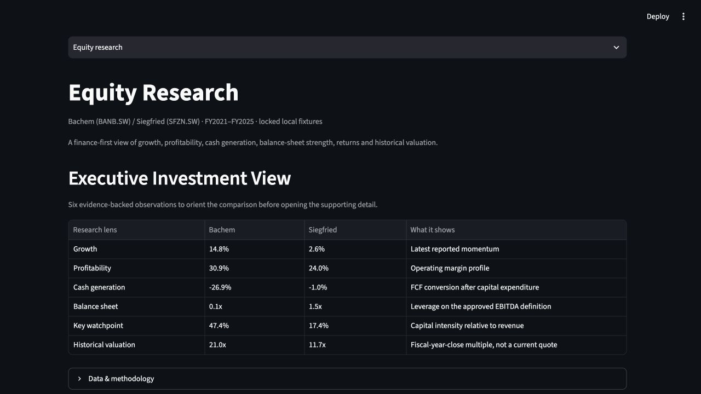
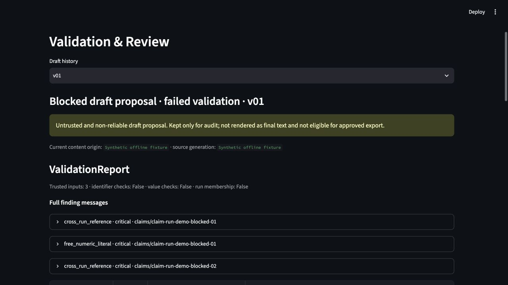

# AI Quant Research Workbench

[](https://github.com/EMen11/AI-quant-research-assistant/actions/workflows/ci.yml?query=branch%3Amain)

[](https://ai-quant-research-assistant-2wpsobhnavfaznnp4pjmxt.streamlit.app/)


[](LICENSE)

A financial research workbench with two complementary experiences: an **Equity Research
Copilot** for company analysis, and an **AI Audit Workbench** for inspecting how financial and
climate research outputs are retrieved, structured, checked, and reviewed.

**One repository. Two research experiences. A shared data and trust foundation.**

1. **Equity Research Copilot** — company analysis for equity research and investment readers.
2. **AI Audit Workbench** — controlled AI workflows, quantitative analytics, and research
   infrastructure for data, AI, and engineering readers.

**[Open the public Streamlit demo](https://ai-quant-research-assistant-2wpsobhnavfaznnp4pjmxt.streamlit.app/)**

The public demo runs from committed offline artifacts. FastAPI, PostgreSQL, and Docker belong to
an optional local stack; none is required to open the hosted Streamlit application.

> **Deployment status — verified 6 October 2026:** the public endpoint is reachable, but its
> current deployment exposes the AI Audit Workbench only. The two-view V4.1 router and Equity
> Research Copilot documented below are present in this repository and available when the current
> code is run locally; publishing that build requires a separate deployment action.

## Choose your reading path

| Your interest | Start here | What you will find |
|---|---|---|
| Equity research / investment analysis | [Part I: Equity Research Copilot](#part-i-equity-research-copilot) | Company comparison, findings, fundamentals, historical valuation, and monitoring |
| AI / software / technical controls | [Part II: AI Audit Workbench](#part-ii-ai-audit-workbench) | Retrieval, structured generation, validation, failure handling, and human review |
| Data engineering / analytics | [Shared Data & Engineering Foundation](#shared-data--engineering-foundation), then either experience | Source preparation, normalization, reproducibility, lineage, and persistence |

These paths are not exclusive. The Equity experience also exposes data lineage and calculation
details, while the AI Audit experience includes quantitative analytics.

```text
AI Quant Research Workbench
│
├── Part I: Equity Research Copilot
│   ├── Fundamentals
│   ├── Historical valuation
│   ├── Sustainability
│   ├── Research Note
│   ├── Risks / Catalysts
│   └── Monitoring
│
└── Part II: AI Audit Workbench
    ├── Retrieval
    ├── Climate Evidence
    ├── Structured generation
    ├── Validation
    ├── Blocked scenario
    ├── Automated assessment
    ├── Human review
    └── Quantitative analytics

Shared foundation:
Versioned data, deterministic calculations, provenance, and tested controls
```

The diagram represents two paths in one repository, not two separately deployed services.

## Table of contents

- [Part I: Equity Research Copilot](#part-i-equity-research-copilot)
- [Part II: AI Audit Workbench](#part-ii-ai-audit-workbench)
- [Shared Data & Engineering Foundation](#shared-data--engineering-foundation)
- [Explore the demo](#explore-the-demo)
- [Verification](#verification)
- [Run locally](#run-locally)
- [Repository and methodology guide](#repository-and-methodology-guide)
- [Limitations](#limitations)
- [License](#license)

## Part I: Equity Research Copilot

**Start here for company analysis and equity research.**

This experience compares Bachem (`BANB.SW`) and Siegfried (`SFZN.SW`), two Swiss contract
development and manufacturing organizations (CDMOs). It uses annual fundamentals and historical
valuation observations for FY2021–FY2025. Its climate comparison is narrower: the committed issuer
disclosures cover FY2025, not the complete five-year financial period.

> **How do Bachem and Siegfried compare financially, and what should an analyst monitor next?**

The output is descriptive decision support. It is not a BUY, SELL, or HOLD recommendation.

### What the analysis shows

The following values were recalculated with the repository's existing analysis builders. Each is
a calculated metric; definition and source-status differences remain visible rather than being
silently harmonized.

| Measure | Period and basis | Bachem | Siegfried |
|---|---|---:|---:|
| Revenue CAGR | FY2021–FY2025; reported revenue endpoints, four annual intervals | **8.4%** | **4.8%** |
| EBITDA margin | FY2025; EBITDA / revenue | **30.9%** | **24.0%** |
| Calculated FCF cash conversion | FY2025; calculated FCF / EBITDA | **-26.9%** | **-1.0%** |
| Calculated capital intensity | FY2025; absolute calculated capex / revenue | **47.4%** | **17.4%** |
| Net debt / EBITDA | FY2025; (debt - cash) / EBITDA | **0.1x** | **1.5x** |
| Historical EV / EBITDA | FY2025 fiscal close; (published market cap + net debt) / EBITDA | **21.0x** | **11.7x** |

Numerical observations:

- **Growth:** Bachem records the higher FY2021–FY2025 revenue CAGR. The data does not establish
  that this growth was organic.
- **Profitability:** Bachem records the higher FY2025 EBITDA margin. Bachem's source EBITDA is
  reported; Siegfried's is source-calculated from statutory EBIT plus depreciation and
  amortization, so the status difference matters.
- **Cash and investment:** calculated FY2025 FCF conversion is negative for both companies and
  materially more negative for Bachem, alongside Bachem's higher calculated capex intensity. High
  capex and negative FCF do not by themselves prove creation or destruction of value.
- **Balance sheet:** Bachem records lower FY2025 net debt / EBITDA; Siegfried carries more leverage
  on the recorded EBITDA basis.
- **Historical valuation:** Bachem records the higher FY2025 fiscal-close EV / EBITDA. Siegfried's
  lower multiple does not by itself prove undervaluation.
- **What to monitor:** Bachem's cash conversion and capital intensity, and Siegfried's leverage,
  profitability, and cash conversion, are the principal financial watchpoints in this snapshot.

Taken together, Bachem shows faster historical growth, a higher recorded margin, lower leverage,
and a higher historical multiple, but also materially heavier FY2025 capital intensity and weaker
calculated cash conversion. Siegfried shows slower growth and a lower margin and multiple, with
less negative calculated cash conversion but higher leverage. The comparison describes a
financial trade-off; it does not identify an automatic winner.

The calculations, unrounded engine outputs, formulas, snapshot identity, and source boundaries are
preserved in the [reproducible findings note](docs/analysis/equity_findings_fy2021_2025.md). The
interpretive statements above are **pending human review**.



<a id="finance-workflow"></a>

### Finance workflow

The experience starts from the analyst question, then moves from operating performance to cash,
capital structure, historical valuation, sustainability evidence, and a controlled note.

#### Fundamentals

Growth measures establish historical top-line direction. Margins separate profit levels. Cash
metrics show how operating cash flow and investment translate into calculated free cash flow.
Balance-sheet and return measures provide context for financing capacity and capital use.

| Area | Measures | What they help assess |
|---|---|---|
| Growth | Revenue, year-on-year growth, FY2021–FY2025 CAGR | Scale and historical top-line momentum |
| Profitability | EBITDA, EBIT, and net margin | Operating economics at different profit levels |
| Cash generation and capital allocation | Operating cash flow, reported/calculated capex, reported/calculated FCF, cash conversion | Cash retained after the recorded investment convention |
| Balance sheet and returns | Net debt, net debt / EBITDA, equity ratio, ROE, comparable distributions | Leverage, financial capacity, and returns on recorded capital |

Reported, calculated, and recomputed variants are not silently blended. Missing inputs remain
missing rather than becoming zero.

#### Historical valuation

The valuation view provides historical fiscal-year-end prices, published market capitalization,
Enterprise Value, EV / Revenue, EV / EBITDA, EV / EBIT, published or calculated P/E, P/B,
free-cash-flow yield, and dividend yield.

These observations are historical, not current market data. Published market capitalization is
kept distinct from closing price multiplied by registered shares. Bachem published P/E is
unavailable, so calculated P/E remains a separately labelled measure. Siegfried's 1:10 share split
is explicit; pre-2025 dividend-per-share values and post-split comparative prices are not forced
into a dividend-yield comparison.

#### Sustainability

The FY2025 sustainability view uses selected issuer disclosures for Scope 1 emissions, Scope 2
market-based and location-based emissions, method-consistent intensities, published targets, and
assurance status. Scope 2 methods must match before values are compared. Assurance scope differs by
issuer, and a sourced disclosure is not independent proof of complete coverage or physical truth.

#### Research Note, risks, catalysts, and monitoring

The public Equity note is assembled by `build_deterministic_analyst_note` from allowlisted metrics
and evidence. It is a versioned Python text-template path, not a live language-model call. Existing
validators then check metric/evidence references, units, periods, prohibited recommendation
language, and other bounded rules. An automated assessment can route the result, but cannot create
a human approval.

The note includes a comparative summary, company profiles, growth and profitability, cash and
balance-sheet context, historical valuation, sustainability, favorable arguments, risks,
catalysts, monitoring indicators, and limitations. Its catalysts are monitoring conditions, not
forecasts. A deliberately blocked note demonstrates that prohibited target-price language produces
no reliable final text.

### Equity-specific limitations

- The comparison universe contains only Bachem and Siegfried.
- Annual financial inputs cover FY2021–FY2025; interim periods and current prices are excluded.
- Historical multiples do not automatically describe today's valuation.
- Published market capitalization is not interchangeable with price multiplied by registered
  shares.
- Bachem published P/E is unavailable; no value is invented to fill it.
- Siegfried split conventions make some historical dividend yields non-comparable.
- EBITDA and other accounting definitions are not identical across issuers.
- Climate evidence covers FY2025 and carries method, boundary, and assurance limitations.
- No consensus, DCF, forecast, recommendation, target price, or price prediction is produced.

<a id="additional-quant--ai-audit-workbench"></a>

## Part II: AI Audit Workbench

**Start here for controlled AI workflows, data quality and software engineering.**

> **How can a research system use language-model output without allowing generated text to become
> the authority for numbers, sources, or approval?**

The workbench separates responsibilities:

```text
Python calculations
      ↓
Metadata filters + documentary retrieval
      ↓
Closed context with authorized IDs
      ↓
Structured draft proposal
      ↓
Independent reference, value, unit, period, and content checks
      ↓
Automated review routing
      ↓
Separate human decision
```

`MetricRecord` and `EvidenceRecord` are server-owned inputs. A `GeneratedDraft` is only a proposal.
A `ValidationReport` records deterministic findings. `AutomatedAssessment` routes the result;
`HumanReview` alone records an explicit human decision.

### Retrieval and climate evidence

Conjunctive metadata filters restrict issuer, document, year, record type, indicator type, and
publication cutoff before ranking. BM25 then ranks the eligible passages. A canonical long-context
baseline supplies all filtered passages in a stable order for comparison; neither BM25 nor the
Python validators are language models.

The climate corpus contains selected passages from two issuer documents, with PDF page, printed
page where available, excerpt, reporting period, unit, Scope 2 method, and coverage status. Missing
and reported-zero remain different states. The corpus is documentary evidence, not a complete ESG
database or proof of issuer performance.

Across the committed ten-question retrieval set, BM25 records recall@1 **0.90** and recall@3
**1.00**; the canonical long-context baseline records **0.70** and **0.90**. The four-question
ranking subset is harder: BM25 records **0.75 / 1.00**, while long-context records **0.25 / 0.75**.
These small internal results do not establish general retrieval performance.

<a id="ai-assisted-research-and-validation"></a>

### Structured generation and what actually runs

The configurable generation contract accepts a closed `SynthesisRequest` and asks for one
structured `DraftProposal`. The model cannot create authoritative metrics, evidence records,
validation outcomes, automated assessments, or human decisions. Local code revalidates the
returned schema and allowlists before any rendering step.

| Path | What actually runs | Provider call now? | Persistence |
|---|---|---:|---|
| Public **Equity Research Copilot** | `build_deterministic_analyst_note` creates a versioned template note; Python validators and renderer run | No | No; public session only |
| Public **AI Audit Workbench**, admissible scenario | Replays a human-reviewed, deterministically normalized fixture derived from a historical Anthropic response; current validation, assessment, and rendering run again | No | No; public session only |
| Public **AI Audit Workbench**, blocked scenario | Replays a deliberately invalid synthetic fixture and reruns the blocking controls | No | No; public session only |
| Configurable LLM client | `AnthropicLLMClient` can make one structured provider request with explicit key, model, timeout, and token limit | Yes, only when explicitly configured and invoked | Metadata is returned to the caller; not used by the public demo |
| Optional local `APP_MODE=live` stack | Streamlit calls FastAPI; FastAPI reruns the workflow from `frozen_offline_fixture` and stores the result in PostgreSQL | No | Yes, locally |

The historical admissible response originally failed a semantic content rule, was sanitized and
normalized deterministically, and was explicitly reviewed before promotion as an offline demo
fixture. The public run does not replay the raw provider payload and does not claim that the
historical call succeeded unchanged.

### Validation, blocked scenario, and human review

Deterministic checks cover reference existence and run membership, metric values and units,
period alignment, structured comparison fields, source coverage, selected prompt-injection
families, self-approval language, unsupported numeric prose, and other versioned rules. These are
bounded controls, not universal hallucination protection.

An admissible result becomes `eligible_for_review`, which still means unapproved. A blocked result
is labelled `review_required` or `abstain`, and reliable final text is withheld. The public review
controls are unauthenticated and session-only; they demonstrate the state transition without
pretending to provide organizational identity or durable authorization.

### Evaluation and quality

The committed workflow evaluation contains **24 cases**: 8 development, 8 validation, and 8
holdout. All 24 match their expected route in that versioned dataset. No represented critical case
is incorrectly marked `eligible_for_review` (**0/18**). The holdout is versioned, not external or
historically blind, and the result does not establish real-world generalization.

See the [retrieval baselines](reports/evaluation/retrieval_baselines.v1.json),
[workflow evaluation](reports/evaluation/workflow_eval.v1.json), and
[retrieval / LLM methodology](docs/methodology/retrieval_and_llm.md).



### Quality and resource usage

The model-call contract records provider, model, prompt version, status, latency, response IDs,
token counts, retry count, cleaned error type, response origin, and a Decimal cost estimate when a
matching pricing snapshot exists.

The admissible public fixture retains metadata from one **historical** Anthropic call:

| Provider / model | Status retained | Latency | Input / output / total tokens | Estimated generation cost |
|---|---|---:|---:|---:|
| Anthropic / `claude-sonnet-5` | `schema_error` before deterministic normalization | 10,818.668 ms | 2,742 / 1,009 / 3,751 | USD 0.015574 |

The estimate uses the dated snapshot `anthropic-standard-token-pricing-2026-09-23-v1`: USD 2 per
million standard input tokens and USD 10 per million standard output tokens, excluding prompt
caching. It estimates that recorded generation attempt only—not analyst labor, infrastructure, or
the full research process. Public replay makes no new provider call, so these historical tokens and
latency are not measurements of the replay. Token counts alone are not converted into energy or
carbon claims.

### Quantitative analytics

The workbench also computes cumulative and annualized returns, volatility, maximum drawdown,
historical and parametric Value at Risk (VaR), Expected Shortfall, Sharpe ratio, covariance and
correlation, and constrained long-only Markowitz optimization with solver diagnostics.

These calculations use a short synthetic adjusted-price fixture and are separate from the real
Bachem/Siegfried Equity data. Equations, annualization choices, loss-sign conventions, and
optimization constraints remain in the
[quantitative methodology](docs/methodology/quant_methodology.md).

<a id="shared-data--engineering-foundation"></a>

## Shared Data & Engineering Foundation

The experiences share principles and selected contracts, but not every ingestion or presentation
path. Equity financials, climate documents, synthetic prices, and generation fixtures retain their
own origins.

### Swiss Equity Data and source boundaries

[Swiss Equity Data (SED)](https://www.swiss-equity-data.ch/) is the separate financial-data product
developed by the author. Its pipeline turns issuer reports into structured financial datasets; the
Equity Research view consumes a frozen, versioned export rather than querying SED at runtime. The
public SED site describes a static source-aware beta, not a live market feed.

The Equity manifest identifies the upstream repository/pipeline as `SED/pdf.extractor`. That is a
source-pipeline identifier, not the public product name. The manifest pins the imported source
state to revision `bc1c54eefd663a257aab71e58fd7953a6239a1fc`. No upstream source-code link is
included because neither this manifest nor the public SED site establishes that `pdf.extractor` is
a public, licensed repository. The separately linked Swiss Finance Data project on the SED site is
not treated as the same system.

The downstream analysis is reproducible from the embedded fixtures and
[Equity manifest](src/ai_quant/fixtures/equity/manifest.v1.json); reproducing the complete upstream
extraction pipeline is outside this repository's boundary.

Climate evidence has a separate origin. It comes from a Bachem FY2025 annual report and a
Siegfried FY2025 sustainability report through the repository's bounded documentary-corpus
pipeline. It is not presented as an SED financial export.

<a id="data-workflow"></a>

### Data workflow

```text
Issuer documents / bounded source artifacts
                 ↓
Ingestion and source preparation
                 ↓
Explicit fields, dates, units, methods, and missing states
                 ↓
Versioned snapshots and manifests
                 ↓
Deterministic calculations / filtered retrieval
                 ↓
Run-scoped metrics, evidence, and provenance
                 ↓
Equity Research or AI Audit presentation
```

- **Sources:** issuer reports feed separate financial and climate preparation paths; the quant demo
  uses a committed synthetic price fixture.
- **Normalization:** company, period, unit, definition, method, and availability are explicit.
  Missing remains distinct from zero; reported stays distinct from calculated.
- **Versioning:** manifests identify schemas, source revisions, fixture files, formulas, and
  evaluation datasets.
- **Calculations:** Python owns numeric transformations. Generated text is never the authority for
  a financial ratio.
- **Traceability:** calculated metrics retain input IDs and field-level source references;
  documentary evidence retains document identity, page, excerpt, and reporting period.
- **Integrity:** SHA-256 hashes help detect changed artifacts and bind records to exact files. A
  matching hash proves identity, not financial truth, extraction correctness, or completeness.

<a id="engineering-architecture"></a>

### Engineering architecture and optional persistence

The default hosted demo loads committed files directly and keeps edits and reviews in the browser
session. The optional local stack adds a FastAPI boundary, SQLAlchemy 2 models, PostgreSQL, Alembic
migrations, and Docker Compose.

Local persistence relates research runs, snapshots, metrics, evidence, draft versions, validation
issues, assessments, reviews, and evaluation reports. Application transactions provide rollback;
idempotency keys and PostgreSQL advisory locks serialize duplicate creation attempts; corrections
create a new draft version; review foreign keys bind decisions to a specific run, draft, and
version. These controls do not make the database WORM, administrator-proof, or a substitute for an
organizational approval system.

`APP_MODE=live` means that the local API and database transport are active. Its current workflow
input is still labelled `frozen_offline_fixture`: it is neither live market data nor live LLM
generation, and it does not persist the public Equity Research Note.

## Explore the demo

<a id="public-demo"></a>

**[Launch the public workbench](https://ai-quant-research-assistant-2wpsobhnavfaznnp4pjmxt.streamlit.app/)**

The hosted endpoint currently supports the Data / AI path below. To follow the Finance path, run
the current repository locally until the V4.1 build is deployed publicly.

### Finance path

1. In the current local V4.1 build, keep **Equity research** selected in the top-level **View**
   control.
2. Read the **Executive Investment View** and **Snapshot**.
3. Compare FY2021–FY2025 history in **Fundamentals** and **Valuation**.
4. Open **Research Note**, then compare the **Valid** and **Blocked** scenarios.
5. Review **Monitoring** and **ESG & Sources**.
6. Open one data or calculation inspector to follow the provenance path.

### Data / AI path

1. Select **AI audit workbench** in the top-level **View** control.
2. Compare the **Admissible** and **Blocked** demo scenarios.
3. Inspect **Climate Evidence** and the response-origin metadata.
4. Review findings and session-only decisions in **Validation & Review**.
5. Open **Quality** for retrieval and workflow-evaluation evidence.
6. Use **Quant** and **Methodology** to inspect calculations and boundaries.

See the [complete demo script](docs/demo_equity_research.md).

## Verification

GitHub Actions installs the locked Python 3.12 environment, runs Ruff, scans tracked files for
secrets, checks the offline public-demo boundary, and executes the full pytest suite. The main
local verification commands are:

```bash
uv run --frozen ruff check .
uv run --frozen pytest -q
git diff --check
```

Verification on the documentation branch before commit:

| Check | Result |
|---|---|
| Ruff | `All checks passed!` |
| Full pytest suite | `442 passed, 20 skipped, 2 warnings in 6.97s` |
| Markdown paths, same-file anchors, and images | All resolved locally |
| External destinations | SED, GitHub Actions, and uv returned HTTP 200; Streamlit loaded in-browser |

The 20 skipped tests require `BLOCK8_LIVE_API_URL` or `BLOCK8_TEST_DATABASE_URL` for live Streamlit
and PostgreSQL integration checks. The two warnings are dependency deprecations from the
FastAPI/Starlette test client. The live browser check also found the deployment-version gap noted
above; it is a deployment issue, not a documentation-link failure.

The versioned evidence for three concise project descriptions is easy to locate:

| Description | Repository evidence |
|---|---|
| Deterministic Python analytics for returns, volatility, drawdown, VaR / ES, and constrained Markowitz optimisation | [Quantitative analytics](#quantitative-analytics), `src/ai_quant/quant/`, and the [quant methodology](docs/methodology/quant_methodology.md) |
| Traceable climate disclosures from two issuers with BM25 retrieval, structured LLM APIs, human review, and 24 evaluated workflow cases | [Part II](#part-ii-ai-audit-workbench), `src/ai_quant/retrieval/`, `src/ai_quant/llm/`, `src/ai_quant/trust/`, and the [workflow report](reports/evaluation/workflow_eval.v1.json) |
| Local FastAPI / SQLAlchemy / PostgreSQL persistence with versioned records and transactions, plus pytest and GitHub Actions CI | [Engineering architecture and optional persistence](#engineering-architecture-and-optional-persistence), `src/ai_quant/api/`, `src/ai_quant/persistence/`, `migrations/`, `tests/`, and `.github/workflows/ci.yml` |

## Run locally

Python 3.12 and [uv](https://docs.astral.sh/uv/) are required for the simplest path:

```bash
git clone https://github.com/EMen11/AI-quant-research-assistant.git
cd AI-quant-research-assistant
uv sync --frozen --all-groups
APP_MODE=demo uv run --frozen streamlit run app.py
```

The app opens **Equity research** by default at `http://127.0.0.1:8501`. No provider key,
database, network data fetch, or adjacent SED checkout is required.

### Optional persistent local stack

```bash
BLOCK8_POSTGRES_DB=ai_quant_local \
BLOCK8_POSTGRES_USER=ai_quant_local \
BLOCK8_POSTGRES_PASSWORD=block8-local-placeholder \
docker compose up --build -d

docker compose ps
docker compose logs --no-color --tail=100
docker compose down
```

Streamlit runs at `http://127.0.0.1:8501` and FastAPI at `http://127.0.0.1:8000`. See the
[deployment guide](docs/deployment.md) and [local stack guide](docs/block8_local_stack.md).

## Repository and methodology guide

<a id="repository-guide"></a>

| Path | Purpose |
|---|---|
| `src/ai_quant/equity/` | Equity models, formulas, fundamentals, valuation, climate metrics, Research Note, and monitoring |
| `src/ai_quant/trust/` | Structured generation, validation, automated assessment, rendering, and review boundaries |
| `src/ai_quant/retrieval/` | Metadata filters, BM25, long-context baseline, and evaluation support |
| `src/ai_quant/llm/` | Configurable Anthropic client, live-capture controls, and pricing estimates |
| `src/ai_quant/quant/` | Historical return, risk, covariance, and optimization calculations |
| `src/ai_quant/api/` | Optional local FastAPI routes and transactional application service |
| `src/ai_quant/persistence/` and `migrations/` | SQLAlchemy/PostgreSQL records, repositories, and schema migration |
| `src/ai_quant/fixtures/` | Frozen Equity, market, climate, pricing, and generation artifacts |
| `docs/analysis/` | Reproducible analytical findings and their interpretation boundary |
| `docs/methodology/` | Quant, corpus, retrieval/LLM, and trust-boundary methods |
| `reports/evaluation/` | Versioned retrieval and workflow evaluation results |

Key reading:

- [Equity findings, FY2021–FY2025](docs/analysis/equity_findings_fy2021_2025.md)
- [Equity implementation validation](docs/implementation/equity_phase4_validation.md)
- [Quantitative methodology](docs/methodology/quant_methodology.md)
- [Sustainability corpus methodology](docs/methodology/sustainability_corpus.md)
- [Retrieval and structured-generation methodology](docs/methodology/retrieval_and_llm.md)
- [Trust boundaries](docs/methodology/trust_boundaries.md)
- [Optional persistent local stack](docs/block8_local_stack.md)

## Limitations

### Equity Research Copilot

- The universe, periods, historical valuation boundary, accounting-definition differences, share
  splits, and sustainability limitations described in Part I constrain every conclusion.
- The new comparative interpretations in this README are pending human review.
- Source hashes and deterministic formulas improve reproducibility but do not certify the economic
  truth or completeness of issuer disclosures.

### AI Audit Workbench

- The quant sample is short and synthetic; it establishes neither investment performance nor
  predictive validity.
- Retrieval and workflow evaluations cover small, versioned datasets and represented error
  families only.
- Validators implement bounded rules and do not provide universal hallucination, prompt-injection,
  or security protection.
- The public provider response is recorded and normalized; it is not regenerated on each visit.
- Public review identity and storage are session-only. Durable local persistence is optional and
  still uses frozen workflow inputs.

For research and educational use only. Not investment advice.

## License

This repository is available under the [MIT License](LICENSE).
