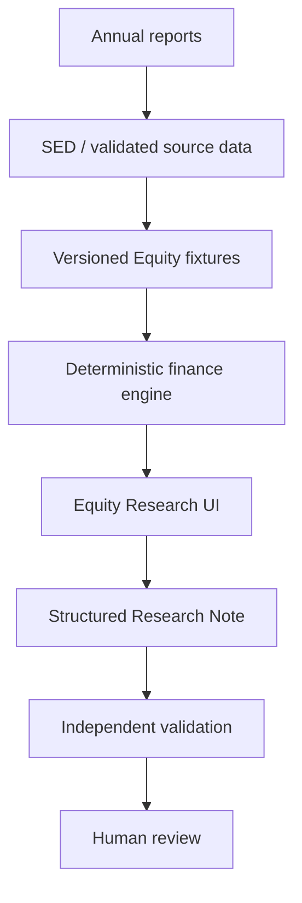

# AI Equity Research Copilot

[](https://github.com/EMen11/AI-quant-research-assistant/actions/workflows/ci.yml?query=branch%3Amain)

[](https://ai-quant-research-assistant-2wpsobhnavfaznnp4pjmxt.streamlit.app/)


A traceable equity research workflow comparing **Bachem (BANB.SW)** and
**Siegfried (SFZN.SW)** across FY2021–FY2025 fundamentals, cash generation, balance sheet,
historical valuation and sustainability. Deterministic financial calculations, source-level
traceability and controlled AI assistance remain separate from explicit human review.

**[Open the public Streamlit demo](https://ai-quant-research-assistant-2wpsobhnavfaznnp4pjmxt.streamlit.app/)**


## At a glance

| Finance | Data | AI |
|---|---|---|
| Compare two Swiss CDMOs over FY2021–FY2025 | Start from validated annual-report inputs | Structure a comparative Research Note |
| Analyze growth, margins, cash generation, capital intensity, leverage and returns | Freeze and version the approved source snapshot | Restrict generation to authorized metrics and evidence |
| Review historical valuation, sustainability, risks and catalysts | Normalize fields, units and periods | Validate values, units, periods and citations independently |
| Read a comparative Research Note and monitoring watchlist | Calculate metrics deterministically in Python | Block prohibited output and require human review |

The default Streamlit experience is designed for an analyst first. Detailed formulas, raw
values, source pages, internal IDs and hashes remain available in optional inspectors.

## The research question

> How do Bachem and Siegfried compare financially, and what should an analyst monitor next?

Bachem and Siegfried are Swiss contract development and manufacturing organizations (CDMOs).
They are close enough in business context to support a focused comparison, while their growth,
profitability, cash profile, capital intensity, balance sheet and historical valuation differ.
The project examines those differences using approved annual data from FY2021 through FY2025.

The result is descriptive decision support. It is not a BUY, SELL or HOLD recommendation.

## Finance workflow

### Fundamentals

The five-year fundamentals view follows the questions an analyst would normally ask.

| Area | Measures | What it helps assess |
|---|---|---|
| Growth | Revenue, year-on-year growth, FY2021–FY2025 CAGR | Scale and historical top-line momentum |
| Profitability | EBITDA margin, EBIT margin, net margin | Operating economics at different profit levels |
| Cash generation | Operating cash flow, capex, free cash flow, cash conversion | How accounting profitability translates into cash after investment |
| Balance sheet & returns | Net debt, net debt / EBITDA, equity ratio, ROE, comparable distributions | Financial capacity, leverage and returns on capital |

Reported, calculated and recomputed variants are never silently blended. The main tables show
the preferred analytical metric; calculation details remain inspectable.

### Valuation

The valuation view covers:

- historical fiscal-year-end closing prices;
- published market capitalization and Enterprise Value;
- EV / Revenue, EV / EBITDA and EV / EBIT;
- published or calculated P/E, plus P/B;
- free-cash-flow yield and dividend yield.

These are **historical FY-end observations, not current market data**. Published and calculated
values remain separate. Published market capitalization is preferred when available. The
Siegfried 1:10 share split is handled explicitly, and non-comparable dividend periods remain
marked as such. Bachem published P/E remains unavailable; calculated P/E is displayed as a
different metric rather than used as a substitute.

### Sustainability

The sustainability comparison uses only approved issuer disclosures:

- Scope 1 emissions;
- Scope 2 market-based and location-based emissions;
- method-consistent carbon intensities;
- published climate targets;
- metric-level assurance and comparability caveats.

A sourced disclosure shows what an issuer published. It is not independent certification of
physical reality, complete coverage or cross-company comparability.

### Research Note

The analyst-facing output includes:

- an Executive Investment View and concise financial comparison;
- separate Bachem and Siegfried investment cases;
- key risks and catalysts / what to watch;
- historical valuation context;
- sustainability considerations;
- a non-predictive monitoring table;
- explicit limitations and human-review status.

The note contains no recommendation, target price, consensus estimate or price prediction.

## Data workflow

```text
Annual reports
      ↓
Validated source data
      ↓
Frozen versioned snapshot
      ↓
Normalized financial fields
      ↓
Deterministic Python calculations
      ↓
Field-level provenance
      ↓
Equity Research application
```

### Source data

Equity inputs come from the validated `SED/pdf.extractor` pipeline. The committed manifest pins
the source state to commit `bc1c54eefd663a257aab71e58fd7953a6239a1fc`. Source documents,
fields, periods, units and extraction methods are retained in the snapshot. Individual file
hashes live in the [Equity manifest](src/ai_quant/fixtures/equity/manifest.v1.json), not in the
product introduction.

### Frozen snapshot

The application does not query SED or the network at runtime. It consumes committed,
hash-checked fixtures so the demo is stable, auditable and reproducible even when the upstream
system is unavailable.

### Normalization

Every financial observation has explicit company, fiscal year, metric and unit coordinates.
Missing values remain missing. Reported and calculated metrics remain distinct. Share-split,
denominator and comparability rules are encoded rather than inferred in the UI.

### Deterministic calculations

**Python owns the numbers.** The language model does not calculate financial ratios. Python
calculates growth, margins, free cash flow, cash conversion, leverage, ROE and historical
valuation multiples from the authorized inputs.

Calculation conventions and tests are documented in the
[V4.1 plan](docs/plans/PLAN_V4_1_EQUITY_RESEARCH_COPILOT.md) and focused
[implementation notes](docs/implementation/equity_phase4_validation.md).

### Provenance

The inspection path is:

```text
displayed metric → calculation → source field → document / page
```

At the technical layer, run-scoped `MetricRecord` and `EvidenceRecord` objects preserve stable
identifiers and allowed references. Versioned manifests and SHA-256 checks protect fixture
identity. Formula versions and input metric IDs make calculated values reproducible.

### Data quality and failure behavior

- Missing is not converted to zero.
- Incompatible periods or bases are not forced into a comparison.
- Invalid or missing denominators block the affected calculation.
- Reported, calculated and recomputed differences stay visible.
- Source limitations remain explicit in the UI and Research Note.

## AI-assisted research and validation

**AI structures the research; it does not own the financial facts.**

```text
Authorized metrics + evidence
        ↓
Structured research draft
        ↓
Independent validation
        ↓
Automated assessment
        ↓
Human review
```

Every quantitative claim must resolve to an authorized metric. Evidence references must belong
to the closed evidence set. Deterministic validators check values, units, periods, citations,
run membership and covered language rules before reliable text can be shown.

Investment recommendations, target prices, unsupported numbers, finance-climate causality and
self-approval language are blocked. Automation can route a valid note to human review, but it
cannot create human approval.

### The blocked scenario

The public demo includes an intentionally invalid scenario containing prohibited target-price
language. Validation marks it as blocked, withholds reliable note text and exposes the relevant
diagnostic. This makes the trust boundary observable rather than merely documented.

### Under the hood

Closed Pydantic models define the boundary between trusted records and untrusted generation.
The workflow materializes `MetricRecord`, `EvidenceRecord`, `GeneratedDraft`,
`ValidationReport`, `AutomatedAssessment` and, only after a real decision, `HumanReview`.
Unknown fields and orphan references fail closed.

See the [trust-boundary methodology](docs/methodology/trust_boundaries.md) and
[retrieval and structured-generation methodology](docs/methodology/retrieval_and_llm.md).

## System flow


```mermaid
flowchart TD
    A["Annual reports"] --> S["SED / validated source data"]
    S --> F["Versioned Equity fixtures"]
    F --> P["Deterministic finance engine"]
    P --> U["Equity Research UI"]
    U --> N["Structured Research Note"]
    N --> V["Independent validation"]
    V --> H["Human review"]
```

The Streamlit `demo` mode is fully offline. The optional local persistent stack adds FastAPI and
PostgreSQL without changing the authority of the frozen Equity inputs.

## Public demo

**[Launch the AI Equity Research Copilot](https://ai-quant-research-assistant-2wpsobhnavfaznnp4pjmxt.streamlit.app/)**

A 60–90 second review path:

1. Open **Equity research**.
2. Read the **Executive Investment View**.
3. Compare the eight headline FY2025 metrics in **Snapshot**.
4. Inspect FY2021–FY2025 growth, margins, cash and leverage in **Fundamentals**.
5. Open **Valuation** and confirm that every observation is historical.
6. Read **Key risks**, **Catalysts / What to watch** and **Monitoring**.
7. Open one source and calculation inspector.
8. Switch the Research Note scenario to **Blocked** and review the validation result.

The historical **AI audit workbench** remains available from the top-level view selector as a
second experience focused on quantitative risk, retrieval, validation and review controls. See
the [demo script](docs/demo_equity_research.md).

## Verification

The V4.1 publication gate was executed on the complete repository state:

| Check | Verified result |
|---|---|
| Ruff | `All checks passed!` |
| Full pytest suite | `442 passed, 20 skipped, 2 warnings` |
| Equity runtime | Offline, no SED checkout or network dependency |
| Financial calculations | Deterministic fixtures and Python formulas |
| Trust workflow | Valid scenario remains pending human review; blocked scenario emits no reliable note |
| Provenance | Raw value, formula, source field, document/page and hashes remain inspectable |

The skipped tests require optional live API or PostgreSQL environment variables. The two
warnings are dependency deprecations from the FastAPI/Starlette test client.

## Limitations

### Equity Research V4.1

- The universe contains only Bachem and Siegfried.
- Inputs are annual FY2021–FY2025 observations; interim periods are not included.
- Valuation uses historical fiscal-year-end data, not current prices.
- No analyst consensus, DCF, forecast or live market feed is included.
- No BUY / SELL / HOLD output, target price or personalized investment advice is produced.
- Bachem published P/E is unavailable; calculated P/E remains a separate metric.
- Sustainability comparability is constrained by issuer boundaries, methods and assurance.
- Human verification remains required before any analytical conclusion is accepted.

### Historical workbench

- The market demo uses a short synthetic price sample and does not establish investment
  performance or predictive validity.
- Retrieval evaluation covers a small versioned question set and represented attack families.
- Public reviews are unauthenticated and session-only; persistence is available only in the
  optional local stack.
- The climate corpus documents selected issuer disclosures without proving complete coverage or
  physical truth.

For research and educational use only. Not investment advice.

## Run locally

Python 3.12 and [uv](https://docs.astral.sh/uv/) are required for the simplest path:

```bash
git clone https://github.com/EMen11/AI-quant-research-assistant.git
cd AI-quant-research-assistant
uv sync --frozen --all-groups
APP_MODE=demo uv run --frozen streamlit run app.py
```

The application opens **Equity research** by default at `http://127.0.0.1:8501`. No provider
key, database, network data fetch or adjacent SED checkout is required.

### Optional persistent local stack

The separate live workflow uses the existing FastAPI/PostgreSQL stack:

```bash
BLOCK8_POSTGRES_DB=ai_quant_local \
BLOCK8_POSTGRES_USER=ai_quant_local \
BLOCK8_POSTGRES_PASSWORD=block8-local-placeholder \
docker compose up --build -d

docker compose ps
docker compose logs --no-color --tail=100
docker compose down
```

Streamlit runs at `http://127.0.0.1:8501` and FastAPI at `http://127.0.0.1:8000`. See the
[deployment guide](docs/deployment.md) and
[persistent stack guide](docs/block8_local_stack.md).

## Additional Quant & AI Audit Workbench

The repository also retains its earlier quantitative and trust-control workbench. It includes:

- cumulative and annualized returns, volatility and drawdown;
- historical and parametric VaR, Expected Shortfall and Sharpe ratio;
- covariance and correlation analysis;
- constrained long-only Markowitz optimization with solver diagnostics;
- climate-evidence retrieval and source inspection;
- BM25 and canonical long-context evaluation;
- valid and blocked structured-generation scenarios;
- optional FastAPI, SQLAlchemy and PostgreSQL persistence.

The full formulas, annualization choices, loss-sign conventions and optimizer constraints are in
the [quantitative methodology](docs/methodology/quant_methodology.md). The historical demo uses
the versioned [`demo_adjusted_prices.csv`](src/ai_quant/fixtures/demo_adjusted_prices.csv)
fixture and is intentionally separate from the Bachem/Siegfried Equity case.

### Specialized evaluation

Across 10 retrieval questions, BM25 reaches recall@1 **0.90** and recall@3 **1.00**; the
canonical long-context baseline reaches **0.70** and **0.90**. Workflow evaluation matches
**24/24** expected outcomes, with no represented critical case incorrectly marked
`eligible_for_review` (**0/18**).

These are small internal evaluations, not claims of universal retrieval or AI reliability.
Versioned results are available in
[retrieval baselines](reports/evaluation/retrieval_baselines.v1.json) and
[workflow evaluation](reports/evaluation/workflow_eval.v1.json).


## Engineering architecture

| Layer | Technology | Purpose |
|---|---|---|
| Research UI | Streamlit | Finance-first analyst workflow |
| Finance engine | Python / pandas | Deterministic financial and quantitative metrics |
| Contracts | Pydantic | Typed data, generation and trust boundaries |
| API | FastAPI | Optional local service boundary |
| Persistence | PostgreSQL / SQLAlchemy | Versioned local research records |
| Runtime | Docker Compose | Reproducible optional local stack |
| Quality | pytest / Ruff / GitHub Actions | Automated verification |

Public `demo` mode reads committed fixtures directly. Local `live` mode adds API and database
transport; its current analytical input remains a frozen offline fixture. Database constraints
and application transactions protect record relationships, but storage is not WORM or
administrator-proof.

## Repository guide

| Path | Purpose |
|---|---|
| `src/ai_quant/equity/` | Equity models, formulas, analysis, valuation, note contract and monitoring |
| `src/ai_quant/trust/` | Generation validation, automated assessment and human-review boundaries |
| `src/ai_quant/quant/` | Historical return, risk and optimization calculations |
| `src/ai_quant/retrieval/` | Filtered BM25, long-context baseline and evaluation support |
| `src/ai_quant/api/` | FastAPI routes and transactional application service |
| `src/ai_quant/persistence/` | SQLAlchemy models, repositories and migration support |
| `src/ai_quant/fixtures/` | Frozen Equity, market, climate and generation inputs |
| `docs/` | Methodology, deployment, implementation evidence and demo guidance |
| `reports/` | Versioned retrieval and workflow evaluation artifacts |

This repository is available under the [MIT License](LICENSE).
