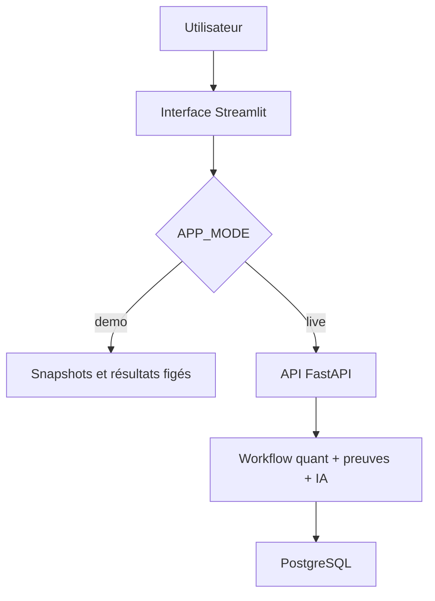
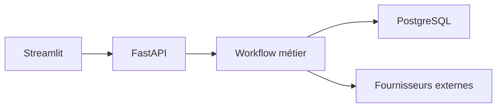

# Speed run Codex — Trustworthy AI Quant Research Workbench

## 0. Objectif du speed run

Ce document transforme le plan détaillé `PLAN_FINAL_AI_QUANT_RESEARCH_WORKBENCH_V3.md` en marche à suivre opérationnelle pour livrer rapidement un projet montrable dans une candidature.

Le produit final reste unique et cohérent :

> Un workbench de recherche financière quantitative qui calcule des métriques de portefeuille de façon déterministe, extrait des preuves de durabilité traçables, utilise un LLM sous contraintes, bloque les affirmations non justifiées et soumet le résultat à une revue humaine.

Le but n'est pas d'implémenter toutes les idées possibles. Le but est de construire une démonstration verticale crédible, testée et déployée, puis d'ajouter les éléments d'architecture qui prouvent que tu sais aller plus loin qu'un prototype.

Références de travail :

- dépôt de départ : <https://github.com/EMen11/AI-quant-research-assistant> ;
- plan complet : `docs/plans/PLAN_FINAL_AI_QUANT_RESEARCH_WORKBENCH_V3.md` ;
- ce guide : `docs/plans/PLAN_SPEEDRUN_CODEX_AI_QUANT.md`.

---

## 1. Décision d'architecture pour aller vite

Le dépôt offrira deux modes qui réutilisent les mêmes modèles de domaine et les mêmes règles de validation.

| Mode | Usage | Données | LLM | Persistance | Déploiement |
|---|---|---|---|---|---|
| `demo` | URL publique de candidature | snapshots financiers et documents versionnés | réponses structurées pré-calculées | état de revue limité à la session | Streamlit Community Cloud |
| `live` | démonstration technique locale | fournisseur de marché + corpus local | Anthropic derrière une interface | PostgreSQL + migrations | Docker Compose |

Le mode public doit afficher clairement : **Frozen public demo**, la date des données et les limites. Il ne doit pas nécessiter de clé Anthropic, effectuer d'appel payant, ni prétendre que les revues sont partagées ou persistantes.

Le mode local prouve l'architecture plus industrielle : Streamlit appelle une API FastAPI, qui orchestre le workflow et écrit ses artefacts dans PostgreSQL.



Cette séparation permet de publier tôt sans exposer de secret ni créer des coûts incontrôlés. Elle doit rester honnête : le README distingue toujours ce qui est réellement exécuté dans chaque mode.

---

## 2. Définition de « terminé avant de postuler »

Ne considère pas le projet terminé tant que les douze conditions suivantes ne sont pas remplies.

- [ ] L'URL publique s'ouvre dans une fenêtre privée sans erreur ni secret.
- [ ] La CI GitHub est verte.
- [ ] Une installation depuis un clone propre permet de lancer les tests.
- [ ] Une seule `MarketSnapshot` alimente tous les calculs d'une analyse.
- [ ] Les formules critiques ont des tests unitaires et une méthodologie documentée.
- [ ] Le corpus couvre deux émetteurs avec des preuves reliées aux pages sources.
- [ ] Le LLM retourne une structure typée et ne crée ni preuve, ni chiffre quantitatif, ni décision humaine.
- [ ] Une valeur, une unité ou un identifiant de preuve inventé provoque `review_required` ou `abstain`.
- [ ] La suite d'évaluation contient au moins 20 cas, dont des cas adversariaux.
- [ ] La démonstration publique montre un cas admissible et un cas bloqué.
- [ ] Le mode local utilise une API, PostgreSQL et des migrations reproductibles.
- [ ] Le README ne revendique que des résultats mesurés dans des artefacts versionnés.

Une URL seule n'est pas une livraison. À l'inverse, un backend sophistiqué sans démonstration compréhensible n'est pas une bonne pièce de portfolio.

---

## 3. Ordre de livraison et budget de temps

Ces durées sont des estimations de travail concentré, pas une promesse.

| Release | Blocs | Résultat | Temps cumulé visé |
|---|---:|---|---:|
| R0 — socle | 0–1 | audit, environnement reproductible, CI, première URL technique | 1–2 jours |
| R1 — démonstration métier | 2–7 | quant, preuves climatiques, IA contrainte, validations, interface publique | 6–9 jours |
| R2 — preuve d'ingénierie | 8–10 | PostgreSQL, FastAPI, Docker, documentation et release | 12–18 jours |

Si la date de candidature devient critique, publie R1 avec une section « limites et prochaine étape ». Ne simule pas R2 dans le README.

---

## 4. Répartition Codex / Claude Code

Codex est l'implémenteur principal. Claude Code joue le rôle de relecteur indépendant aux blocs 2, 6, 8 et 10.

Règle absolue : **ne laisse jamais Codex et Claude modifier les mêmes fichiers au même moment**.

Cycle recommandé :

1. Codex implémente un bloc sur une branche dédiée.
2. Tu exécutes toi-même les commandes de vérification proposées.
3. Tu demandes à Claude Code une revue en lecture seule.
4. Tu redonnes les observations à Codex en lui demandant de les vérifier, pas de les accepter aveuglément.
5. Tu relances les tests, inspectes le diff, puis commits.

Une conversation Codex par bloc est préférable. Cela réduit le contexte parasite et facilite le retour arrière.

---

## 5. Préparation manuelle

Dans un terminal :

```bash
git clone https://github.com/EMen11/AI-quant-research-assistant.git
cd AI-quant-research-assistant
git status --short
git fetch --all --prune
git switch -c speedrun/application-ready
mkdir -p docs/plans
```

Copie ensuite ce guide et le plan V3 dans `docs/plans/`, puis vérifie :

```bash
git status --short
git rev-parse HEAD
git remote -v
```

Ne mets aucune clé API dans le dépôt. Les fichiers `.env`, les secrets Streamlit et les exports bruts contenant des données sensibles doivent être ignorés par Git.

---

## 6. Préambule à coller au début de chaque demande Codex

Copie ce texte, puis ajoute le prompt du bloc concerné.

```text
Tu travailles dans le dépôt AI-quant-research-assistant.

Avant toute modification :
1. Lis complètement AGENTS.md s'il existe.
2. Lis docs/plans/PLAN_SPEEDRUN_CODEX_AI_QUANT.md et les sections pertinentes de docs/plans/PLAN_FINAL_AI_QUANT_RESEARCH_WORKBENCH_V3.md.
3. Inspecte git status, la structure du dépôt et le code actuel. Préserve toutes les modifications utilisateur non liées.

Contraintes permanentes :
- Travaille uniquement sur le bloc demandé et arrête-toi à son critère de sortie.
- N'effectue aucune opération Git destructive. Ne pousse et ne déploie rien sans demande explicite.
- Ne lis, n'affiche et ne commits aucun secret. Utilise des noms de variables factices dans .env.example.
- Les calculs financiers sont déterministes et réalisés en Python, jamais par le LLM.
- Le LLM ne crée pas les preuves, ne valide pas sa propre réponse et ne produit jamais la décision humaine.
- En APP_MODE=demo, aucun appel réseau payant ou appel Anthropic ne doit être nécessaire.
- Ajoute ou adapte les tests associés à chaque changement.
- Utilise les dépendances les plus simples répondant au besoin. N'ajoute pas un framework sans justification mesurable.

À la fin :
1. Exécute les vérifications prévues par le dépôt.
2. Montre le résumé du diff et signale tout fichier utilisateur laissé intact.
3. Donne : fichiers modifiés, commandes exécutées, résultats des tests, hypothèses, limites/blocages et message de commit proposé.
4. N'enchaîne pas sur le bloc suivant.
```

---

## 7. Bloc 0 — Auditer le dépôt réel

### Pourquoi

Le plan V3 a été établi à partir du commit `0d58a238026744c729343f588eb3cdcd313d23fd`. Le dépôt peut avoir changé. Codex doit donc prendre le code présent comme source de vérité avant de toucher à l'architecture.

### Prompt Codex

```text
Effectue uniquement le Bloc 0 : audit reproductible du dépôt actuel, sans refactoriser l'application.

Vérifie et documente notamment :
- commit, branche, arborescence, point d'entrée et procédure de lancement réelle ;
- écarts entre le README et le code ;
- dépendances, version Python, lockfile et imports fragiles ;
- stockage SQLite direct ou couche repository/SQLAlchemy ;
- appels de données de marché répétés, périodes incohérentes et gestion des données manquantes ;
- formules de rendement, volatilité, drawdown, VaR, expected shortfall et optimisation ;
- modèles LLM codés en dur, prompts, sortie structurée, timeouts et erreurs ;
- chargement PDF et rattachement réel des sources ;
- tests, CI, lint, typage, conteneurs et migrations ;
- recherche accidentelle de secrets par noms et fichiers suivis, sans imprimer leurs valeurs.

Crée seulement :
- docs/audit_baseline.md : constats avec fichier et symbole concernés, sévérité P0/P1/P2, et proposition ;
- SPEEDRUN_STATUS.md : les blocs 0 à 10 avec statut TODO/DOING/DONE, branche, commit de référence et commandes de contrôle.

Ne corrige rien dans ce bloc. Termine par les cinq risques les plus importants et le périmètre exact recommandé pour le Bloc 1.
```

### Vérification humaine

- Le rapport cite des fichiers et des symboles précis.
- Il sépare les faits observés des recommandations.
- Aucun code de production n'a changé.

### Commit

```bash
git add docs/audit_baseline.md SPEEDRUN_STATUS.md docs/plans
git commit -m "audit: capture current repository baseline"
```

---

## 8. Bloc 1 — Socle reproductible, CI et premier déploiement

### Pourquoi

Le déploiement précoce détecte immédiatement les problèmes de version Python, dépendances, chemins et point d'entrée. À ce stade, l'application peut encore afficher « Work in progress ».

### Prompt Codex

```text
Effectue uniquement le Bloc 1 : établir un socle reproductible et déployable en conservant le comportement utile existant.

Implémente :
- Python 3.12 explicite ;
- pyproject.toml comme source de dépendances et de configuration ;
- environnement reproductible avec uv et un lockfile commité ;
- commandes documentées pour installer, lancer, tester et vérifier ;
- package Python importable sans sys.path.append ;
- configuration typée avec APP_MODE=demo par défaut et validation au démarrage ;
- .env.example sans valeur réelle et .gitignore approprié ;
- Ruff et pytest ;
- dossiers tests/unit, tests/integration et tests/evaluation ;
- une interface LLM minimale avec FakeLLM ;
- une interface MarketDataProvider avec FrozenMarketDataProvider ;
- au moins cinq tests de démarrage/configuration/import ;
- GitHub Actions sur Python 3.12 exécutant installation verrouillée, lint et tests ;
- une page Streamlit minimale qui démarre sans réseau ni secret en mode demo.

Garde une compatibilité Streamlit Community Cloud. N'ajoute ni base de données, ni RAG, ni FastAPI dans ce bloc.

Mets SPEEDRUN_STATUS.md à jour seulement si tous les contrôles du bloc passent.
```

### Commandes de contrôle

Adapte uniquement si Codex a documenté une commande équivalente :

```bash
uv sync --frozen --all-groups
uv run ruff check .
uv run pytest -q
APP_MODE=demo uv run streamlit run app.py
```

Ouvre ensuite l'application locale et vérifie qu'elle fonctionne sans `.env`.

### Premier déploiement technique

1. Pousse la branche seulement après avoir inspecté les fichiers suivis.
2. Dans Streamlit Community Cloud, sélectionne le dépôt, la branche et le vrai point d'entrée.
3. N'ajoute aucune clé Anthropic.
4. Vérifie l'URL dans une fenêtre privée.
5. Note l'URL et le commit déployé dans `SPEEDRUN_STATUS.md`.

Ce déploiement R0 ne doit pas encore être partagé comme démonstration finale.

### Commit

```bash
git add -A
git diff --cached --check
git commit -m "chore: establish reproducible Python project and CI"
```

---

## 9. Bloc 2 — Construire le noyau quantitatif fiable

### Pourquoi

Le projet doit d'abord être un bon projet quant. Les briques IA et durabilité viendront consommer ses résultats, jamais les remplacer.

### Périmètre

Pour le MVP, limite l'univers à trois actifs liquides maximum et à une devise de référence. Utilise une fenêtre d'observation définie et documentée. La démonstration publique charge un snapshot figé ; le mode live peut en créer un nouveau.

### Prompt Codex

```text
Effectue uniquement le Bloc 2 : créer le noyau quantitatif déterministe, reproductible et testé.

Ajoute des modèles typés pour PortfolioDefinition et MarketSnapshot. Une analyse doit référencer exactement un snapshot immuable contenant : actifs, prix ajustés, plage de dates, fréquence, devise, fournisseur, date d'extraction, valeurs manquantes et hash du contenu.

Implémente en fonctions pures :
- rendements historiques simples ou logarithmiques, avec choix unique documenté ;
- rendement annualisé et volatilité annualisée avec conventions explicites ;
- drawdown et maximum drawdown ;
- VaR historique et paramétrique avec niveau et horizon explicites ;
- expected shortfall ;
- matrice de corrélation ;
- optimisation long-only avec somme des poids égale à 1, diagnostics et gestion d'échec.

Le taux sans risque doit être configurable, daté et affiché. Aucun signal buy/sell et aucune promesse prédictive.

Crée une fixture de prix figée versionnée pour le mode demo. Dans un run live, télécharge au plus une fois les données puis réutilise le même snapshot partout.

Ajoute des tests unitaires avec petits exemples calculables, propriétés/invariants, données manquantes, actifs constants, échantillon insuffisant et échec de l'optimiseur. Compare les fonctions critiques à une seconde implémentation indépendante quand c'est pertinent.

Crée docs/methodology/quant_methodology.md avec formules, unités, annualisation, hypothèses, limites et absence de backtest prédictif. Ne travaille pas encore sur le corpus durabilité ou le LLM.
```

### Ce que tu dois comprendre avant de valider

- Une volatilité annualisée dépend de la fréquence et du facteur d'annualisation.
- La VaR est un quantile de perte ; l'expected shortfall résume les pertes au-delà de ce seuil.
- Une optimisation qui retourne des poids n'est pas nécessairement fiable : il faut vérifier convergence, contraintes et sensibilité.
- Réutiliser un snapshot unique empêche que deux composants comparent des fenêtres de marché différentes.

### Revue Claude Code — lecture seule obligatoire

```text
Effectue une revue strictement en lecture seule du Bloc 2. Ne modifie aucun fichier.
Vérifie les formules, signes, unités, conventions d'annualisation, horizon de VaR/ES, alignement des dates, gestion des NaN, unicité du snapshot et diagnostics de l'optimiseur.
Recherche les risques de look-ahead ou les affirmations de performance non prouvées.
Rends un tableau : sévérité P0/P1/P2, fichier:symbole, preuve, conséquence, correction minimale, test à ajouter. Termine par PASS ou FAIL.
```

Redonne ensuite le rapport à Codex :

```text
Vérifie indépendamment chaque observation de la revue ci-dessous contre le code. Corrige seulement les P0/P1 confirmés et les tests associés. Explique les observations rejetées. Relance toute la suite et arrête-toi.

<COLLER_LA_REVUE_ICI>
```

### Critère de sortie

Une page Quant affiche les données du snapshot, les métriques, leurs unités et les hypothèses. Tous les tests quantitatifs passent hors ligne.

### Commit

```bash
git add -A
git diff --cached --check
git commit -m "feat: build reproducible tested quant core"
```

---

## 10. Bloc 3 — Contrats de confiance et tranche verticale

### Pourquoi

Avant d'intégrer un vrai LLM, il faut définir qui a le droit de produire quoi. Ces frontières rendent ensuite les erreurs détectables.

### Modèles à séparer

| Objet | Responsable | Contenu |
|---|---|---|
| `MetricRecord` | moteur Python | valeur, unité, formule/version, snapshot |
| `EvidenceRecord` | pipeline documentaire | extrait, document, page, période, hash |
| `GeneratedDraft` | LLM | texte structuré et références proposées |
| `ValidationReport` | validateurs Python | erreurs, avertissements, contrôles |
| `AutomatedAssessment` | politique automatique | `eligible_for_review`, `review_required`, `abstain` |
| `HumanReview` | analyste | `approved`, `corrected`, `rejected`, `escalated` |

### Prompt Codex

```text
Effectue uniquement le Bloc 3 : matérialiser les frontières de confiance et une tranche verticale entièrement hors ligne.

Crée les six modèles métier distincts décrits dans le plan. Les identifiants de métriques et de preuves sont créés côté serveur. Un GeneratedDraft ne peut référencer que des identifiants appartenant au run courant.

Le LLM fictif peut choisir une structure narrative et proposer des références, mais Python injecte les valeurs numériques finales dans le rendu. Le ValidationReport est créé par des règles déterministes. AutomatedAssessment et HumanReview doivent avoir des vocabulaires distincts et ne jamais être confondus.

Construis un workflow en mémoire avec les fakes existants :
snapshot -> métriques -> preuves factices -> draft structuré -> validations -> assessment -> review optionnelle.

Ajoute deux scénarios versionnés :
1. scénario valide, admissible à la revue ;
2. scénario contenant un identifiant inconnu ou une valeur inventée, obligatoirement bloqué.

Affiche ces scénarios dans Streamlit. N'ajoute ni PDF, ni vrai retriever, ni appel Anthropic, ni base de données dans ce bloc.

Teste les transitions autorisées, l'isolation entre runs, l'injection des nombres et l'impossibilité pour le draft de s'auto-approuver.
```

### Critère de sortie

Tu peux expliquer en moins d'une minute pourquoi une réponse plausible mais non prouvée est bloquée, et le démontrer dans l'interface.

### Commit

```bash
git add -A
git commit -m "feat: add typed trust boundaries and vertical workflow"
```

---

## 11. Bloc 4 — Corpus de sustainable finance traçable

### Pourquoi

La durabilité entre ici comme objet de recherche financière : exposition climatique, qualité du reporting, comparabilité et limites des données. La mesure de ressources IA restera une couche opérationnelle distincte.

### Corpus MVP

- Émetteurs candidats : Bachem et Siegfried.
- Repli : Lonza ou PolyPeptide si les publications officielles des deux premiers ne permettent pas un corpus comparable.
- Indicateurs ciblés : Scope 1, Scope 2 location-based, Scope 2 market-based, énergie, part renouvelable, objectifs climatiques et assurance lorsque publiée.

Tu dois fournir à Codex les URL officielles ou les fichiers téléchargés. Ne lui demande pas d'inventer des données absentes.

### Prompt Codex

```text
Effectue uniquement le Bloc 4 : construire un petit corpus climatique officiel, traçable et annoté.

Utilise uniquement les rapports officiels fournis pour deux émetteurs. Crée un manifeste avec issuer, titre, année, URL officielle, date d'accès, chemin local, SHA-256 et statut d'extraction. Conserve une copie autorisée ou documente un téléchargement reproductible.

Extrais le texte en conservant numéro de page et provenance. Crée des objets typés : SustainabilityObservation, CoverageFinding, ComparisonAssessment, AssuranceAssessment et ClimateTarget.

Chaque observation doit distinguer :
- valeur zéro ;
- information non trouvée ;
- information explicitement non publiée ;
- information ambiguë ;
- valeur réelle et objectif ;
- valeur publiée par l'émetteur et valeur dérivée par notre code ;
- Scope 2 location-based et market-based.

Ajoute au moins 12 cas représentatifs annotés manuellement avec document, page, extrait court, période, unité et statut. Implémente un filtre cutoff_date empêchant d'utiliser un document publié après la date de recherche.

Une preuve démontre seulement que le document publie l'information citée ; elle ne certifie pas la vérité physique de l'affirmation. Représente explicitement le statut d'assurance lorsqu'il est disponible.

Ajoute des tests d'extraction, de page, de hash, de cutoff, d'unités et de valeurs manquantes. Documente les limites de comparabilité. Aucun LLM ne doit décider des valeurs extraites dans ce bloc.
```

### Vérification humaine

Ouvre chaque page citée dans les 12 annotations et contrôle manuellement l'extrait, la période, l'unité et la nature de l'indicateur.

### Commit

```bash
git add -A
git commit -m "feat: add traceable climate evidence corpus"
```

---

## 12. Bloc 5 — Retrieval évalué et LLM structuré

### Pourquoi

Un vector store n'est pas une preuve de qualité. Commence par des baselines simples, mesure leurs résultats, puis n'ajoute embeddings ou reranker que s'ils corrigent une erreur observée.

### Prompt Codex

```text
Effectue uniquement le Bloc 5 : ajouter un retrieval mesurable et une synthèse LLM structurée sans déplacer les frontières de confiance.

Retrieval :
- implémente d'abord filtres de métadonnées + BM25 ;
- ajoute une baseline long-context lorsque le petit corpus tient dans le contexte ;
- crée 10 questions de référence avec pages pertinentes attendues ;
- mesure recall@1, recall@3 et rang du premier passage pertinent ;
- compare les baselines dans un artefact JSON versionné ;
- n'ajoute embeddings, pgvector ou reranker que si une lacune observée le justifie, avec comparaison avant/après.

LLM :
- définis LLMClient, FakeLLMClient et AnthropicLLMClient ;
- utilise une sortie structurée validée par Pydantic ;
- effectue une synthèse principale par run, sans personas séquentiels ;
- n'accorde aucun outil au modèle ;
- limite les identifiants citables à l'allowlist du run ;
- fixe timeout, gestion d'erreur et version de prompt ;
- enregistre fournisseur, modèle, latence, statut, tokens si disponibles et coût estimé avec source tarifaire/datée ;
- crée une fixture demo à partir d'une réponse live validée, sans donnée secrète.

Le mode demo doit rester entièrement hors ligne. Le mode live lit la clé dans l'environnement et échoue proprement si elle manque. Ne logue jamais le prompt complet s'il peut contenir des données sensibles.

Teste le schéma, les erreurs, timeout, allowlist et fonctionnement hors ligne. Documente exactement quel modèle est utilisé sans le coder en dur dans la logique métier.
```

### Gestion du secret

- Local : variable d'environnement ou `.env` ignoré par Git.
- CI : utilise uniquement des fakes pour les tests obligatoires.
- Public demo : aucune clé Anthropic.
- Ne colle jamais une clé dans une conversation, un ticket, une capture ou un log.

### Critère de sortie

Le même workflow fonctionne avec le fake, la fixture publique et le client live. Une panne du LLM ne détruit pas les calculs quantitatifs ni les preuves déjà collectées.

### Commit

```bash
git add -A
git commit -m "feat: add evaluated retrieval and structured llm synthesis"
```

---

## 13. Bloc 6 — Validateurs et évaluation de bout en bout

### Pourquoi

Ce bloc transforme « l'IA semble bonne » en résultats observables. Il doit surtout mesurer les erreurs dangereuses, pas seulement une moyenne flatteuse.

### Prompt Codex

```text
Effectue uniquement le Bloc 6 : construire les validateurs déterministes et une suite d'évaluation reproductible.

Crée des datasets versionnés :
- tests/evaluation/retrieval_gold.v1.jsonl ;
- tests/evaluation/workflow_eval.v1.jsonl.

Le workflow_eval doit comporter au moins 20 cas séparés en dev, validation et holdout. Chaque cas spécifie entrées, claims requis/acceptables/interdits, outcome attendu et sévérité. Inclure : ID inventé, chiffre inventé, unité erronée, période erronée, confusion Scope 2 LB/MB, document futur, source contradictoire, champ manquant, prompt injection dans un document et tentative d'auto-approbation.

Implémente des validateurs pour :
- appartenance des IDs au run ;
- cohérence chiffres/valeurs de référence ;
- unités et périodes ;
- type de Scope 2 ;
- fraîcheur/cutoff ;
- contradictions et couverture minimale.

La politique transforme uniquement le ValidationReport en AutomatedAssessment. Une erreur critique connue doit empêcher eligible_for_review.

Produis un rapport machine-readable avec matrice de confusion, taux de détection par type, taux de faux eligible_for_review, latence et version des données/prompts. La CI exécute la partie déterministe ; les appels live sont manuels et séparés.

N'affirme « zéro faux eligible » que pour le dataset versionné et identifié. Ne généralise pas ce résultat au monde réel.
```

### Revue Claude Code — lecture seule obligatoire

```text
Revois en lecture seule les frontières de confiance et les évaluations du Bloc 6. Cherche surtout : validation réalisée par le LLM lui-même, fuite entre dev et holdout, assertions tautologiques, cas adversariaux trop faciles, IDs contrôlés côté client, chiffres non injectés par Python et chemin permettant une auto-approbation.
Rends les constats P0/P1/P2 avec preuve fichier:symbole, scénario d'exploitation et test de non-régression. Termine par PASS ou FAIL. Ne modifie rien.
```

### Gate

- Tous les cas critiques connus sont détectés.
- Aucun cas critique connu n'est marqué `eligible_for_review`.
- Le rapport est régénérable par une commande documentée.

### Commit

```bash
git add -A
git commit -m "eval: add validation policies and reproducible evaluation suite"
```

---

## 14. Bloc 7 — Interface analyste et release publique R1

### Pourquoi

L'interface doit rendre visible la méthode, les preuves et les blocages. Un joli texte final sans audit trail affaiblirait précisément le message « trustworthy AI ».

### Prompt Codex

```text
Effectue uniquement le Bloc 7 : livrer l'interface analyste du mode demo à partir des artefacts déjà disponibles.

Organise l'application Streamlit en six vues ou onglets sobres :
1. Overview ;
2. Quant ;
3. Climate Evidence ;
4. Validation & Review ;
5. Quality ;
6. Methodology.

Ajoute un sélecteur de scénario avec au minimum :
- un cas complet admissible à la revue ;
- un cas délibérément invalide et bloqué.

Affiche : date et hash du snapshot, hypothèses quant, métriques avec unités, preuves avec issuer/document/page/extrait, couverture et limites, claims générés, erreurs de validation, état automatique et éventuelle décision humaine.

En mode demo, HumanReview est explicitement « session-only » dans st.session_state. En mode live, utilise une interface de repository qui sera persistée au Bloc 8.

Interdis tout export portant le statut approved tant qu'une vraie HumanReview approved n'existe pas. Une correction doit créer une nouvelle version du draft et relancer la validation. Ne montre une métrique de qualité que si l'artefact correspondant existe.

Ajoute des textes courts expliquant ce que le système fait et ne fait pas. Optimise la lisibilité sur écran portable. N'invente aucune métrique pour remplir un écran vide.
```

### Gate R1

Avant de présenter l'URL :

- teste les deux scénarios de bout en bout deux fois ;
- recharge la page et contrôle le comportement attendu de l'état session-only ;
- ouvre l'URL en navigation privée et sur mobile ;
- vérifie les liens vers le dépôt et la méthodologie ;
- vérifie que les dates des données figées sont visibles ;
- confirme qu'aucun bouton ne déclenche un appel live ;
- capture deux screenshots propres pour le README futur.

### Commit

```bash
git add -A
git commit -m "feat: deliver analyst review dashboard and demo scenarios"
```

À ce point, R1 est une candidature viable si la date est urgente. Les trois blocs suivants rendent le dépôt plus convaincant techniquement.

---

## 15. Bloc 8 — PostgreSQL, FastAPI et Docker Compose

### Architecture locale cible



Les objets métier ne doivent pas dépendre directement de Streamlit, FastAPI ou SQLAlchemy.

### Prompt Codex

```text
Effectue uniquement le Bloc 8 : ajouter le chemin live local persistant sans casser le mode demo public.

Persistance :
- SQLAlchemy 2 et repositories explicites ;
- PostgreSQL pour le mode live ;
- Alembic, avec migration initiale testée depuis une base vide ;
- tables minimales : research_runs, market_snapshots, metric_records, source_documents, evidence_records, generated_drafts, draft_claims, validation_issues, automated_assessments, human_reviews, model_calls et evaluation_runs ;
- contraintes de clés, unicité et timestamps UTC ;
- corrections et revues versionnées, sans écrasement silencieux ;
- caractère append-only garanti au niveau applicatif et documenté comme tel, sans prétendre à une immutabilité réglementaire.

API FastAPI :
- POST /analyses, synchrone pour le MVP, retourne 201 et accepte une clé d'idempotence ;
- GET /analyses/{id} ;
- GET /analyses/{id}/evidence ;
- POST /analyses/{id}/reviews ;
- GET /evaluations/latest ;
- GET /health.

Utilise des schémas d'entrée/sortie typés, statuts HTTP cohérents et erreurs sans stack trace interne. Le reviewer est un nom saisi et explicitement non vérifié tant qu'il n'existe pas d'authentification.

Docker :
- images non-root lorsque possible ;
- services api, streamlit et postgres ;
- healthchecks, volume nommé et réseau privé ;
- stratégie claire : un seul propriétaire des migrations au démarrage ;
- aucune valeur secrète dans l'image ou compose ;
- commandes de lancement et d'arrêt documentées.

Ajoute tests de repositories sur PostgreSQL, tests API et un smoke test local Streamlit -> API -> DB. Le mode demo ne doit importer ou contacter ni PostgreSQL ni Anthropic au démarrage.
```

### Revue Claude Code — lecture seule obligatoire

```text
Revois en lecture seule le Bloc 8. Vérifie migrations depuis zéro, contraintes SQL, atomicité, idempotence, versionnement des corrections, validation côté serveur, statuts HTTP, exposition d'erreurs/secrets, utilisateur non-root, healthchecks et indépendance complète du mode demo.
Liste les P0/P1/P2 avec fichier:symbole et test correctif. Signale toute affirmation d'immuabilité ou d'identité reviewer non prouvée. Termine par PASS ou FAIL. Ne modifie rien.
```

### Commandes de contrôle

```bash
docker compose build
docker compose up -d
docker compose ps
docker compose logs --no-color --tail=100
uv run pytest -q
docker compose down
```

Le test depuis base vide doit être rejoué au moins une fois avec un volume de test jetable clairement identifié. Ne supprime jamais un volume contenant des données utiles.

### Commit

```bash
git add -A
git commit -m "feat: add postgres api and reproducible local stack"
```

---

## 16. Bloc 9 — Préparer et vérifier le déploiement final

### Prompt Codex

```text
Effectue uniquement le Bloc 9 : préparer une release publique sûre du mode demo.

Audite tous les chemins d'import et de démarrage avec APP_MODE=demo. Le mode demo ne doit nécessiter ni PostgreSQL, ni Docker, ni Anthropic, ni téléchargement réseau. Versionne les fixtures utilisées et affiche leurs dates/hash.

Vérifie le point d'entrée Streamlit, Python 3.12, le lockfile, les dépendances système éventuelles, les limites de taille, la gestion d'erreur visible et les liens externes.

Ajoute :
- docs/deployment.md ;
- une checklist de smoke test ;
- un contrôle automatisé garantissant l'absence d'appel au client live en mode demo ;
- une recherche de secrets dans les fichiers suivis, sans jamais afficher les valeurs trouvées ;
- un test de démarrage hors ligne.

Ne crée aucun bouton live dans la version publique. N'ajoute aucun secret à Streamlit Cloud. Mets à jour SPEEDRUN_STATUS.md avec le commit candidat, mais ne marque le bloc DONE qu'après vérification de l'URL réelle.
```

### Déploiement manuel

1. Inspecte `git diff` et `git status`.
2. Pousse le commit candidat sur GitHub.
3. Déploie la branche dans Streamlit Community Cloud.
4. Laisse la section Secrets vide pour ce mode.
5. Teste le bon scénario, le scénario bloqué, les preuves et les liens.
6. Teste dans une fenêtre privée et sur téléphone.
7. Note URL, commit et heure du smoke test.

### Vérification post-déploiement avec Codex

```text
Effectue une vérification strictement en lecture seule de cette URL publique et du commit candidat : <URL>.
Compare le comportement observé à docs/deployment.md et à la définition de terminé. Vérifie chargement anonyme, navigation, deux scénarios, provenance des preuves, affichage des limites, absence de chemin live et liens cassés. N'effectue aucune action d'écriture externe.
Rends un verdict GO, GO WITH LIMITATIONS ou NO-GO avec preuves et correctifs minimaux.
```

### Commit

```bash
git add -A
git commit -m "chore: prepare secure reproducible public demo"
```

---

## 17. Bloc 10 — README, preuves et release de candidature

### Pourquoi

Le recruteur commencera probablement par le README et l'URL. Le document doit raconter ce que le système prouve, pas énumérer une pile technologique.

### Prompt Codex

```text
Effectue uniquement le Bloc 10 : aligner la documentation finale sur le code réellement vérifié.

Réécris le README autour de :
- proposition de valeur en trois phrases ;
- lien vers la démonstration publique ;
- screenshot ou GIF court ;
- architecture et frontières de confiance ;
- noyau quantitatif et conventions ;
- corpus climatique, provenance et limites de comparabilité ;
- retrieval et résultats mesurés ;
- génération structurée, validations et human-in-the-loop ;
- résultats d'évaluation ;
- démarrage demo ;
- démarrage live avec API/PostgreSQL/Docker ;
- sécurité, confidentialité et limites ;
- roadmap courte.

Ajoute un tableau explicite Implemented / Demo-only / Planned. Toute valeur numérique du README doit provenir d'un artefact versionné et nommer sa version. Supprime les termes production-ready, institutional-grade, hallucination-free, compliant ou carbon-aware si le dépôt ne les démontre pas précisément.

Ajoute une architecture Mermaid compacte, les commandes exactes d'installation et le statut CI. Vérifie tous les liens et commandes depuis un clone propre. Mets à jour SPEEDRUN_STATUS.md uniquement si chaque gate est objectivement satisfaite.

Propose une note de release et un tag, mais ne crée ni tag, ni release, ni push sans autorisation explicite.
```

### Revue finale Claude Code — lecture seule

```text
Effectue la revue finale en lecture seule comme un recruteur quant/AI exigeant. Compare chaque affirmation du README au code, aux tests et aux artefacts. Vérifie aussi reproductibilité, UX de la démo, limites, citations, résultats quant, sustainable finance, trustworthy AI et efficacité des ressources IA.
Donne : P0/P1/P2, claims non prouvés, commandes réellement reproduites, lacunes visibles en entretien, puis verdict GO / GO WITH LIMITATIONS / NO-GO. Ne modifie aucun fichier.
```

Ne publie la release que si :

- P0 = 0 ;
- CI verte ;
- URL publique fonctionnelle ;
- deux démonstrations complètes réussies ;
- limites restantes documentées ;
- toute métrique annoncée est reproductible.

### Commit et tag après validation

```bash
git add -A
git commit -m "docs: publish application-ready research workbench"
git tag -a v1.0.0-demo -m "Application-ready public demo"
```

Le push du commit et du tag reste une action manuelle consciente.

---

## 18. Routine quotidienne de speed run

Au début de chaque session :

```bash
git status --short
git branch --show-current
git log -1 --oneline
```

Puis :

1. Choisis un seul bloc ou un seul correctif P0/P1.
2. Colle le préambule commun puis le prompt du bloc dans Codex.
3. Lis le plan de Codex avant qu'il modifie le code.
4. Inspecte le diff ; ne valide pas un changement que tu ne peux pas résumer.
5. Exécute les tests toi-même.
6. Pour les blocs prévus, lance la revue Claude en lecture seule.
7. Redonne les constats confirmés à Codex.
8. Fais un commit petit et nommé.
9. Mets à jour `SPEEDRUN_STATUS.md`.
10. Note les notions à revoir plus tard dans `docs/learning_backlog.md` sans bloquer la livraison.

### Les cinq questions à te poser sur chaque bloc

1. Quelle entrée reçoit ce composant ?
2. Quelle sortie produit-il et avec quel schéma ?
3. Quelle source de vérité utilise-t-il ?
4. Comment échoue-t-il et comment le voit-on ?
5. Quel test me prouve le comportement annoncé ?

Si tu sais répondre à ces cinq questions, tu pourras défendre le projet en entretien même si Codex a accéléré l'implémentation.

---

## 19. Ce que Codex ne doit pas faire pendant le speed run

- Réécrire tout le dépôt en une seule passe.
- Ajouter un framework d'agents pour simuler de la modernité.
- Conserver quatre personas LLM séquentiels sans mesure de valeur.
- Utiliser le LLM pour les formules financières ou pour vérifier ses propres affirmations.
- Ajouter embeddings, reranker ou pgvector avant une baseline et une évaluation.
- Télécharger de nouvelles données plusieurs fois dans un même run.
- Confondre donnée absente et valeur nulle.
- Présenter une preuve documentaire comme certification de vérité réelle.
- Présenter une estimation de tokens comme empreinte carbone mesurée.
- Affirmer qu'un reviewer est authentifié sans système d'identité.
- Affirmer une immutabilité réglementaire garantie seulement par du code applicatif.
- Modifier le README avec des métriques non reproductibles.
- Déployer, pousser, créer une release ou supprimer des données sans ton accord explicite.

---

## 20. Prompt de secours quand un bloc part mal

```text
Arrête toute nouvelle fonctionnalité. N'effectue aucune opération destructive.

Diagnostique uniquement l'échec actuel :
- reproduis-le avec la commande minimale ;
- sépare cause racine, symptômes et effets secondaires ;
- indique les fichiers réellement concernés ;
- propose le correctif minimal ;
- ajoute d'abord un test qui échoue si possible ;
- applique le correctif seulement dans le périmètre du bloc ;
- relance les contrôles ciblés puis la suite complète.

À la fin, donne les résultats exacts et ce qui reste incertain. N'enchaîne sur aucune amélioration.
```

---

## 21. Ordre exact des prompts

- [ ] Préambule commun + Bloc 0
- [ ] Préambule commun + Bloc 1
- [ ] Déploiement technique R0
- [ ] Préambule commun + Bloc 2
- [ ] Revue Claude Bloc 2
- [ ] Correction Codex des constats confirmés
- [ ] Préambule commun + Bloc 3
- [ ] Préambule commun + Bloc 4
- [ ] Contrôle manuel des 12 annotations
- [ ] Préambule commun + Bloc 5
- [ ] Préambule commun + Bloc 6
- [ ] Revue Claude Bloc 6
- [ ] Correction Codex des constats confirmés
- [ ] Préambule commun + Bloc 7
- [ ] Gate et publication R1
- [ ] Préambule commun + Bloc 8
- [ ] Revue Claude Bloc 8
- [ ] Préambule commun + Bloc 9
- [ ] Vérification post-déploiement Codex
- [ ] Préambule commun + Bloc 10
- [ ] Revue finale Claude
- [ ] Release seulement après verdict acceptable

---

## 22. Références opérationnelles officielles

- Streamlit Community Cloud — déployer une application : <https://docs.streamlit.io/deploy/streamlit-community-cloud/deploy-your-app>
- Streamlit Community Cloud — gestion des secrets : <https://docs.streamlit.io/deploy/streamlit-community-cloud/deploy-your-app/secrets-management>
- GitHub Actions — construire et tester un projet Python : <https://docs.github.com/en/actions/tutorials/build-and-test-code/python>
- Docker Compose — documentation : <https://docs.docker.com/compose/>

---

## 23. Ton premier geste maintenant

Ne demande pas encore à Codex de moderniser tout le dépôt.

1. Crée la branche `speedrun/application-ready`.
2. Place les deux plans dans `docs/plans/`.
3. Ouvre une nouvelle conversation Codex dans le dépôt.
4. Colle le préambule commun, puis uniquement le prompt du Bloc 0.
5. Attends son audit, vérifie qu'il n'a pas modifié le code, puis commit le rapport.
6. Passe ensuite au Bloc 1.

Cette discipline paraît légèrement plus lente pendant les premières heures. Elle évite surtout de perdre plusieurs jours dans une réécriture impossible à vérifier ou à expliquer.
